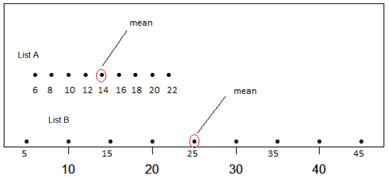

```{r setup, include = FALSE}

library(tidyverse)
library(gapminder)

library(learnr)
library(ggridges)
library(gradethis)

knitr::opts_chunk$set(warning = FALSE,
                      message = FALSE,
                      echo = FALSE, 
                      fig.height = 3,
                      fig.width = 5,
                      fig.align = "center")

life <- read_csv(file="data/life_exp.csv") %>% 
  mutate(
    state = str_to_title(state),
    county = str_to_title(county),
    region = case_when(state %in% c("Connecticut", "Maine", "New Hampshire","Massachusetts", "New Hampshire", "Rhode Island", "Vermont", "New Jersey", "New York", "Pennsylvania") ~ "NorthEast", 
   state %in% c("Illinois", "Indiana", "Michigan", "Ohio", "Wisconsin", "Iowa", "Kansas", "Minnesota", "Missouri", "Nebraska","North Dakota", "South Dakota" ) ~ "MidWest",
   state %in% c("Delaware", "Florida", "Georgia", "Maryland", "North Carolina", "South Carolina", "Virginia", "West Virginia", "Alabama", "Kentucky", "Mississippi", "Tennessee", "Arkansas", "Louisiana","Oklahoma", "Texas", "District Of Columbia") ~ "South",
   state %in% c("Arizona", "Colorado", "Idaho", "Montana", "Nevada", "New Mexico", "Utah", "Wyoming","Alaska", "California", "Hawaii", "Oregon", "Washington") ~ "West")) %>%
     relocate(region, .after = "county")
   


life_wa <- life %>%
  filter(state == "Washington") 
```

## Introduction

There are generally four characteristics of distributions that are of interest: 

  - the center, 
  
  - the spread or variability of the distribution,
  
  - the shape of the distribution, which can be described in terms of the modality and the skew.
  
  - outliers
  
We will discuss each of these in turn in this tutorial. We will be using data wrangling functions from **tidyverse**, so let's go ahead and load it. We will also use the package **ggridges** to make density ridge plots. 

```{r load-packages-tidy, exercise=TRUE}
library(tidyverse)
library(ggridges)
```

```{r load-packages-tidy-solution}
library(tidyverse)
library(ggridges)
```

```{r load-packages-tidy-check}
grade_this_code("You've successfully loaded the packages.")
```

## Data

Researchers in public health have compiled a dataset called `life` on the demographics of every county in the US. The data is shown below. We see that we have five variables: the state name, the county name, the region, then the average life expectancy, and the median income. 

```{r life}
life
```


We are going to begin by focusing on the life expectancy in the state of Washington which happens to have 39 counties. Filter the `life` dataset for counties from "Washington", and name the resulting data frame `life_wa`. Which county in WA state has the highest life expectancy? the lowest? 


```{r life-wa, exercise=TRUE}


```

```{r life-wa-hint-1}

life_wa <- life %>%
  filter(state == "___") 


```


```{r life-wa-hint-2}

life_wa <- life %>%
  filter(state == "Washington") 

life_wa %>% arrange(___) 

```


```{r life-wa-hint-3}

life_wa <- life %>%
  filter(state == "Washington") 

life_wa %>% arrange(desc(expectancy)) 

```


```{r life-exp-mean}
life_wa_summary <- life_wa %>%
  summarise(
    mean = round(mean(expectancy), 2),
    med = round(median(expectancy), 2),
    var = round(var(expectancy), 2),
    sd = round(sd(expectancy), 2),
    iqr = round(IQR(expectancy), 2)
  )
```


## Measures of center

A **measure of center** refers to a **typical** observation. 
For example, you may have heard statements like the typical life expectancy in the US is 77.6 years, but where does that number come from? 

### Mean

Let's take a closer look at the life expectancies for counties in Washington. Make a histogram of the values for `expectancy` in the dataset `life_wa` you created earlier. 


```{r life-wa-view2, exercise=TRUE}


```


```{r life-wa-view2-hint-1}
ggplot(data = life_wa,
       mapping = aes( x = ___)) +
  geom___()

```


```{r life-wa-view2-hint-2}
ggplot(data = life_wa,
       mapping = aes( x = expectancy)) +
  geom____()

```


```{r life-wa-view2-hint-3}
ggplot(data = life_wa,
       mapping = aes( x = expectancy)) +
  geom_histogram( binwidth = 0.83, 
                  alpha = 0.5)

```

If you had to guess a typical life expectancy for Washington state, what would you pick?
One statistic we commonly use is the arithmetic mean, commonly referred to as the average. Calculate the mean life expectancy in WA state. 


```{r mean, exercise = TRUE}


```


```{r mean-hint-1}
life_wa %>% summarise( ___ )

```

```{r mean-hint-2}
life_wa %>% summarise(mean_lifeExp = mean(___))

```

```{r mean-hint-3}
life_wa %>% summarise(mean_lifeExp = mean(expectancy, na.rm=TRUE))

```


The average life expectancy for counties in Washington is `r life_wa_summary$mean` years.
Let's add that value as a red, dashed line to our histogram.

```{r life-wa-plot-mean}
ggplot(data = life_wa, aes(x = expectancy)) +
  geom_histogram(binwidth = 0.83, 
                 alpha = 0.5) +
  geom_vline(xintercept = life_wa_summary$mean, 
             color = "red", 
             linetype = "longdash", 
             size = 1) +
  labs(title = "Life expectancy in WA state",
       subtitle = "Mean shown in red")
```

The mean can be thought of as the balance point - center of gravity - of the data. This highlights an important feature of the mean: its sensitivity to extreme values. For this reason, when working with skewed (imbalanced) distributions, the mean is not an appropriate measure of center.

### Median

Another measure of "typical" is the **median**. 
The median is the 50th percentile, i.e. the middle value in the sorted data. Let's take another look at the sorted life expectancies.

```{r}
life_wa %>%
  arrange(expectancy) %>% 
  pull(expectancy) 
```

The value that cuts the data in half is `r life_wa_summary$med`. We can also calculate this using the `median()` function. We could also find the median using the `quantile` function. 

```{r median, echo = TRUE}
life_wa %>%
  summarise(median = median(expectancy, na.rm=TRUE))
```

Let's add that value as a blue, solid line to our histogram.

```{r life-wa-plot-mean-med}
ggplot(data = life_wa, aes(x = expectancy)) +
  geom_histogram(binwidth =0.83,alpha=0.5) +
  geom_vline(xintercept = life_wa_summary$mean, 
             color = "red", 
             linetype = "longdash", 
             size = 1) +
  geom_vline(xintercept = life_wa_summary$med, 
             color = "blue", 
             size = 1) +
  labs(title="Life expectancy in WA state",
       subtitle = "Mean shown in red, median in blue")
```

For the life expectancies in WA state, the mean and median are practically equal since the distribution is roughly symmetric. 


The **mode** is yet another measure of center. The mode is the number that occurs the most frequently in the dataset. To find the mode, we can `count()` the life expectancy values, and identify the most frequent one. Modes are most useful for describing distributions with multiple peaks and we will not consider this measure further in this tutorial.


### Groupwise comparisons

Often we are interested in comparing means and other summary measures across different groups. For example, suppose we are interested in comparing typical life expectancy across the different regions in the United States. 

Fill in the blanks in the code chunk below to calculate the mean and median of `expectancy` by region. Which region has the highest mean life expectancy? How about the lowest?


<!---
Creating a new variable called `coast` that takes the value "west" if the state value is one of "California", "Oregon", or "Washington", and "not west" otherwise, and save it back to the original dataset. Then `group_by` this new variable and calculate the mean and median of life expectancy for each coast. 
--->


```{r life-groupby, exercise=TRUE}
life %>%
  group_by(___) %>%
  summarise(___)

```

```{r life-groupby-hint-1}
life %>%
  group_by(region) %>%
  summarise(___)

```


```{r life-groupby-hint-2}

life %>% 
  group_by(region) %>%
  summarize( mean_exp = mean(___), 
             median_exp = median(___) )
```

```{r life-groupby-solution}


life %>%
  group_by(region) %>%
  summarize( mean_exp = mean(expectancy, na.rm=TRUE), 
             median_exp = median(expectancy, na.rm=TRUE) ) 


```


<!---
We learn by looking at both mean and median, that the typical West Coast county has a slightly higher typical life expectancy than counties not on the West Coast.
--->


## Your Turn!

### Calculate center measures

In this exercise, you will repeat some of the earlier calculations for the `gapminder` dataset, which tracks demographic data in countries of the world over time. First, familiarize yourself with the dataframe by running the code in the code chunk below.

```{r peek-gapminder, exercise = TRUE} 

library(gapminder)

gapminder
```

In the following exercise, you will write code to compare how the life expectancy differs from continent to continent in the year 2007. <!---This requires that you conduct your analysis not at the country level, but aggregated up to the continent level. This is made possible by the one-two punch of `group_by()` and `summarize()`.---> Here are the specific steps that need to be in your code:

- Create a dataset called `gap2007` that contains only data from the year 2007.

- Using `gap2007`, calculate the mean and median `lifeExp` for each `continent`.

<!---
- Confirm the trends that you see by generating side-by-side boxplots of `lifeExp` by `continent`.
--->

```{r ex1, exercise = TRUE}

```

```{r ex1-hint-1} 

gap2007 <- gapminder %>% 
     filter(year == 2007)
```

```{r ex1-hint-2} 
gap2007 <- gapminder %>% 
     filter(year == 2007)

gap2007 %>%
  group_by(continent) %>%
  summarize(mean = mean(lifeExp, na.rm = TRUE), 
            median = median(lifeExp, na.rm = TRUE))
```


## Measures of variability

The variability of a set of numbers refers to how much the numbers vary or change. For example, the list of numbers shown below
$$List\:1: 0, 20, 40, 60, 80, 100$$
is much more variable than the following list of numbers 
$$ List\:2: 0, 50, 50, 50, 50, 100$$

How should we summarize the variability in a set of numbers? A simple idea is to report the range, in other words the largest value minus the smallest value in the list. However, this is too coarse a summary which does not capture the variation adequately. For instance, the range for both Lists 1 and 2 is 100 suggesting they are equally variable, which we know to be untrue.

A better way to summarise the variability in a set of numbers is as the spread of the data around the mean. This is called the **standard deviation** and we will now discuss how to calculate this summary.


### Standard deviation

Let's return to the `life_wa` dataframe. Earlier we found that the mean life expectancy in Washington state was 78.96 years. We will now calculate the standard deviation of life expectancy among counties in Washington state.

In order to calculate this measure, we first find the difference - or deviation -  between each observation and the mean. 
This results in `r nrow(life_wa)` deviations, some positive, some negative as shown below. 

```{r wa-deviation}
life_wa %>%
  mutate(deviation = expectancy - life_wa_summary$mean) %>% 
  select(-state, -income, -region)
```

We'd like to have a single number which captures the typical magnitude of the deviations, and one option is to take their average. But if we do that, the positive and negative deviations will cancel each other and we will end up with an answer of 0. 

To avoid this (and also to give higher weight to deviations from the mean that are larger), we square each deviation first:

```{r ma-deviation-sq}
life_wa %>%
  mutate(
    deviation = expectancy - life_wa_summary$mean,
    deviation_sq = deviation^2
    ) %>% 
  select(-state, -income, -region)
```

and then we take the average of the squared deviations. This is calculated below for the life expectancy in the 39 counties of WA state. 

```{r wa-deviation-sq-sum}
life_wa %>%
  mutate(
    deviation = expectancy - life_wa_summary$mean,
    deviation_sq = deviation^2
    ) %>%
  summarise(mean_deviation_sq = mean(deviation_sq))
```

This number represents the typical size of the squared deviations and therefore we take the square root so it is in the same units as the original data.   


```{r wa-deviation-sqroot-sum}
life_wa %>%
  mutate(
    deviation = expectancy - life_wa_summary$mean,
    deviation_sq = deviation^2
    ) %>%
  summarise(standard_deviation = sqrt(mean(deviation_sq)))
```

<!---
This new measure is better, but it has an undesirable property: it will just keep getting bigger the more data that you add. You can fix this unconstrained growth by dividing this measure by the number of observations, `r nrow(life_wa)`. Now, the quantity is a useful measure found by the following steps: 


1. Find the center (mean) of the data
2. Then find the squared distance between each observation and the mean
3. Divide the total squared distance by the number of observations ($n$) in the dataset


```{r wa-deviation-sq-mean-pop}
life_wa %>%
  mutate(
    deviation = expectancy - life_wa_summary$mean,
    deviation_sq = deviation^2
    ) %>%
  summarise(avg_sq_deviation = sum(deviation_sq) / nrow(life_wa))
```


If you change the $n$ to an $n - 1$, you get what's called the *sample variance*, one of the most useful measures of the spread of a distribution. Mathematically it is written as
$$s^2 = \frac{1}{n-1}\sum\limits_{i=1}^{n-1} (x_i - \bar{x})^2.$$
This is calculated below for the life expectancy in the 39 counties of WA state.

```{r wa-deviation-sq-mean-samp}
life_wa %>%
  mutate(
    deviation = expectancy - life_wa_summary$mean,
    deviation_sq = deviation^2
    ) %>%
  summarise(s_square = sum(deviation_sq) / (nrow(life_wa) - 1))
```

 

In R, you can use the built-in `var()` function to calculate the sample variance.

```{r var, echo=TRUE}
life_wa %>%
  summarise(var = var(expectancy, na.rm=TRUE))
```

Another useful measure is the square root of the *sample variance*, which is called the *sample standard deviation* or just `sd()` in R. The convenient thing about the sample standard deviation is that, once computed, it is in the same units as the original data. 
--->

In R, you can use the built-in `sd()` function to calculate the standard deviation.^[The slight discrepancy between the number reported by R and our calculation is due to the fact that we found the average of the squared deviations by dividing by 39 (number of counties) while R divides by 38 (number of counties - 1). The approach taken in R is preferable for reasons that we will not go into further.]

```{r sd, echo = TRUE}
life_wa %>%
  summarise(sd = sd(expectancy, na.rm = TRUE))
```
 


Since the standard deviation is a measure of spread of about the mean, it is the natural measure to use when using the mean as a typical value. 
For example, we might say that average life expectancy in WA state is `r life_wa_summary$mean` years give or take `r life_wa_summary$sd` years.

<!---

How many values lie within 1 standard deviation of the mean life expectancy? Ideally, we would like to see at least 50% of data points captured within this range in order to accurately describe the spread.

```{r }
ggplot(data = life_wa, aes(x = expectancy)) +
  geom_histogram(binwidth = 0.83, 
                 alpha = 0.5) +
  geom_vline(xintercept = life_wa_summary$mean, color = "red", linetype = "longdash", size = 1) +
  geom_vline(xintercept = life_wa_summary$mean-life_wa_summary$sd, linetype = "longdash", size = 1) +
  geom_vline(xintercept = life_wa_summary$mean+life_wa_summary$sd, linetype = "longdash", size = 1) +
  geom_segment(mapping=aes(x=life_wa_summary$mean-life_wa_summary$sd, y = 5, xend=life_wa_summary$mean+life_wa_summary$sd, yend=5))+
  annotate(geom="text",x=78.5, y=5.5,label="1 SD")+
  annotate(geom="text",x=79.5, y=5.5,label="1 SD")+
  labs(title = "Life expectancy in WA state",
       subtitle = "Mean shown in red, one standard deviation from the mean in black   ")
```

Use `filter` to isolate counties in WA state with life expectancy in the range 78.96 $\pm$ 1.17 years. How many such counties are there?

```{r one-sd-mean, exercise=TRUE}


```

```{r one-sd-mean-hint-1}

life_wa %>% 
  filter(expectancy >= ___, 
         expectancy <= ___) %>% nrow()
  

```

```{r one-sd-mean-hint-2}

life_wa %>% 
  filter(expectancy >= 78.96 - 1.17, 
         expectancy <= ___) %>% nrow()
  

```

```{r one-sd-mean-hint-3}

life_wa %>% 
  filter(expectancy >= 78.96 - 1.17, 
         expectancy <= 78.96 + 1.17) %>% nrow()
  

```

For the life expectancy in WA state, you should see that $\frac{27}{39}$ or about `r 100*round(27/39,2)`% of the counties lie within 1 standard deviation of the average life expectancy.

Now that you know how to calculate the standard deviation, let's see how good you are at eyeballing it. One of the lists below has a standard deviation of about 5. Which one? Remember: about 50% of the observations lie within $\pm$ 1 standard deviation around the mean value.





```{r mc5}
question("Which list of numbers, A or B, has a standard deviation of about 5?",
  answer("A", correct=TRUE, message = "Great! Some deviations are less than 5 and some larger than 5, which makes this a good guess"),
  answer("B", message = "Not quite, the deviations are typically much larger than 5"),
  allow_retry = TRUE
)
```

--->


### Interquartile range

Another measure of spread that is good to know about is the **interquartile range**, or **IQR**. The IQR is the distance between the two numbers that cut-off the middle 50% of your data. This should sound familiar from the discussion of boxplots: the height of the box is exactly the IQR. 

In order to calculate the IQR, we need to find the 25th and 75th, percentiles of our data. We will let R do the calculation for us.

We can either calculate these numbers using the `quantile()` function and take their difference...

```{r quartile, echo = TRUE}
life_wa %>%
  summarise(
    q1 = quantile(expectancy, 0.25, na.rm = TRUE),
    q3 = quantile(expectancy, 0.75, na.rm = TRUE),
    iqr = q3 - q1
  )
```

... or we can use the built-in `IQR()` function.

```{r iqr, echo = TRUE}
life_wa %>%
  summarise(iqr = IQR(expectancy, na.rm = TRUE) )
```

Just as the standard deviation and mean go hand in hand, the IQR and median are often reported together. More specifically, we might say something along the lines of the median life expectancy is `r life_wa_summary$median` years, and the range of the middle 50% of the values is 1.65 years.

<!---
### Range 

The final measure is simply the **range** of the data: the distance between the maximum and the minimum.

```{r range, echo = TRUE}
life_wa %>%
  summarise(
    min = min(expectancy, na.rm = TRUE),
    max = max(expectancy, na.rm = TRUE),
    range = max - min
  )
```
--->

### Groupwise comparisons

Just as with means and medians, we might wish to compare the measures of variability across groups.

Fill in the blanks in the code chunk below to calculate the standard deviation and IQR of `expectancy` by region. Which region has the most variability in life expectancy as measured by the standard deviation?

```{r life-var-groupby, exercise=TRUE}
life %>%
  group_by(___) %>%
  summarise(___)

```

```{r life-var-groupby-hint-1}
life %>%
  group_by(region) %>%
  summarise(___)

```


```{r life-var-groupby-hint-2}

life %>% 
  group_by(region) %>%
  summarize( sd = sd(___), 
             iqr= IQR(___) )
```

```{r life-var-groupby-solution}


life %>%
  group_by(region) %>%
  summarize( sd = sd(expectancy, na.rm  = TRUE), 
             iqr= IQR(expectancy, na.rm = TRUE) )


```


## Your Turn!

### Calculate measures of variability


Let us return to the `gapminder` dataframe to calculate the standard deviation and the IQR of life expectancy across countries within each continent for the year 2007.

Recall that we first filtered the rows for the year 2007 and then calculated the summary measures of center. Fill in the blanks in the code chunk below to additionally calculate the standard deviation and the IQR.

```{r variability-gapminder, exercise = TRUE} 
gap2007 <- gapminder %>% 
     filter(year == 2007)

gap2007 %>%
  group_by(continent) %>%
  summarize(mean = mean(lifeExp, na.rm = TRUE), 
            median = median(lifeExp, na.rm = TRUE),
            sd = ___, 
            iqr = ___)
```


```{r variability-gapminder-hint-1} 
gap2007 <- gapminder %>% 
     filter(year == 2007)

gap2007 %>%
  group_by(continent) %>%
  summarize(mean = mean(lifeExp, na.rm = TRUE), 
            median = median(lifeExp, na.rm = TRUE),
            sd = sd(lifeExp, na.rm = TRUE), 
            iqr = ___)
```

```{r variability-gapminder-hint-2} 
gap2007 <- gapminder %>% 
     filter(year == 2007)

gap2007 %>%
  group_by(continent) %>%
  summarize(mean = mean(lifeExp, na.rm = TRUE), 
            median = median(lifeExp, na.rm = TRUE),
            sd = sd(lifeExp, na.rm = TRUE), 
            iqr = IQR(lifeExp, na.rm = TRUE))
```

## Choosing a measure of center and spread 

For any dataset, you can compute all of the summaries we have discussed so far, but which ones are the most meaningful? The most commonly used in practice are the mean and standard deviation, so that's often a good place to start. But what happens if the dataset has some extreme observations?

Let's say that Gray's Harbor, the county with a life expectancy around 76, instead had a life expectancy of 25. We'll create a new dataset with that value and call it `life_wa_extreme`.

```{r life-ma-extreme, echo = TRUE}
life_wa_extreme <- life_wa %>%
  mutate(expectancy = if_else(county == "Grays Harbor County", 25, expectancy))
```

Below is a look at the histogram of the data with the made up extreme value.

```{r life-ma-extreme-plot}
ggplot(data = life_wa_extreme, aes(x = expectancy)) +
  geom_histogram(binwidth=5) 
```

If you recompute the mean and the standard deviation, you see that they have both changed quite a bit, especially the standard deviation which has gone through the roof! These measures are sensitive to extreme values.

```{r sd-var-extreme, echo = TRUE}
life_wa_extreme %>%
  summarise(
    mean = mean(expectancy, na.rm = TRUE),
    sd  = sd(expectancy, na.rm = TRUE)
  )
```

<!---
If you recompute the range, it will certainly increase because it is completely determined by the extreme values. For this reason, the range is not often used.

```{r range-extreme, echo = TRUE}
life_wa_extreme %>%
  summarise(
    min = min(expectancy, na.rm = TRUE),
    max = max(expectancy, na.rm = TRUE),
    range = max - min
  )
```

--->

However, if you recompute the median and IQR, you would see that they haven't budged. Because the rank of observations is all that matters when computing the percentiles, the median and IQR are quite unaffected by extreme values. This reveals a good situation for using the median and IQR: when your dataset is heavily skewed or has extreme observations.

```{r iqr-extreme, echo = TRUE}
life_wa_extreme %>%
  summarise(median=median(expectancy, na.rm = TRUE), 
            iqr = IQR(expectancy, na.rm = TRUE)  )
```


## Shape and transformations

In this section, we will learn about describing the shape or form of a set of numbers. The shape is typically described in terms of the modality (number of peaks) and the skew (symmetry or lack thereof).

### Modality

The modality of a distribution is the number of prominent humps that show up in the distribution. If there is a single mode, as in a bell shaped curve, it is called "unimodal." If there are two prominent modes, it's called "bimodal." If it has three modes or more, the convention is to refer to it as "multimodal." There is one last case: when there is no distinct mode. Because the distribution is flat across all values, it is referred to as "uniform."


### Skew


The other aspect to the shape of the distribution concerns its skew.
If a unimodal distribution has a long tail that stretches out to the right, it's referred to as "right-skewed."

If that long tail stretches out to the left, its referred to as "left-skewed." If you have trouble remembering which is which, just remember that the name of the skew is in the direction the long tail is.

If neither tail is longer than the other, the distribution is called "symmetric."


To build some familiarity with distributions of different shapes, consider the four that are plotted here. 

```{r mr3-pre}
set.seed(12)
x1 <- density(rnorm(30, 0.6, 0.2))
x2 <- density(rnorm(30, 0.6, 0.2))
x3 <- density(rexp(30, 1))
x4 <- density(c(rnorm(15, 1, 0.1), rnorm(15, 1.7, 0.1)))
y <- c(x1$y, x2$y, x3$y, x4$y)
x <- c(x1$x, x2$x, x3$x, x4$x)
d <- data.frame(x = x,
                y = y,
                group = rep(LETTERS[1:4], each = 512))
ggplot(d, aes(x = x, y = y)) +
  geom_line() +
  facet_wrap(~group, scales = "free") +
  theme(axis.title.x = element_blank(),
        axis.text.x = element_blank(),
        axis.ticks.x = element_blank(),
        axis.title.y = element_blank(),
        axis.text.y = element_blank(),
        axis.ticks.y = element_blank())
```


```{r mc3}
question("Which of the following options does the best job of describing their shape in terms of modality and skew/symmetry?",
  answer("A: bimodal symmetric; B: unimodal symmetric; C: unimodal left-skewed, D: bimodal right-skewed."),
  answer("A: unimodal symmetric; B: unimodal right-skewed; C: unimodal right-skewed, D: bimodal symmetric.", correct = TRUE),
  answer("A: unimodal right-skewed; B: unimodal left-skewed; C: unimodal left-skewed; D: bimodal symmetric."),
  answer("A: unimodal left-skewed; B: bimodal symmetric; C: unimodal right-skewed, D: unimodal symmetric."),
  allow_retry = TRUE,
  incorrect = "A useful mnemonic is the ' skew is where there is few'. That is, a left-skewed distribution has fewer values in its left tail."
)
```


### Shape of income

Let's compare the shape of distributions of  `income` across the four regions of the United States to see what shape these distributions take. There are several plot types that we could use here. We will construct density ridge plots. 


To make ridge plots, we use a `geom_density_ridges` layer and map the `y` aesthetic to the categorical variable. You can, in addition map `fill` to the same categorical variable in order to vary the color of each ridge plot.  We will also specify an `alpha` level of 0.3 in the `geom` layer. This allows the colors to be somewhat transparent so that we can see where they overlap.

Fill in the blanks to create a ridge plot comparing the income distributions across different regions of the United States.

```{r inc, exercise = TRUE}
ggplot(data = life,
       mapping = aes( x = ___, 
                      y= ___, 
                      fill = ___))+
  geom___() +
  labs()

```


```{r inc-hint-1}
ggplot(data = life,
       mapping = aes( x = income, 
                      y = region, 
                      fill = region))+
  geom___() +
  labs()

```

```{r inc-hint-2}
ggplot(data = life,
       mapping = aes( x = income, 
                      y = region, 
                      fill = region))+
  geom_density_ridges( alpha = ___) +
  labs()

```

```{r inc-solution}
ggplot(data = life,
       mapping = aes( x = income, 
                      y = region, 
                      fill = region))+
  geom_density_ridges( alpha = 0.3) +
  labs(x = "Income", 
       title = "Income distribution by region")

```

We see that the income distribution is highly skewed to the right for each of the four regions. 

The choice of measure for center and spread can dramatically impact our understanding of the data, so it is important that you consider the shape of the distribution before deciding on the measure.


```{r mc2-pre}
rskew <- rexp(1000, 1)
symm <- rnorm(1000)
d <- data.frame(x = c(rskew, symm),
                distribution = rep(c("A", "B"), c(1000, 1000)))
ggplot(d, aes(x = x, fill = distribution)) +
  geom_density(alpha = 0.3)
```


```{r mc2}
question("Which measure of center and spread would be *worst* for describing the two distributions shown here?",
  answer("A: median + IQR, B: median + IQR", message = "Given the two distributions, this seems like it'd be okay."),
  answer("A: median + IQR, B: mean + SD", message = "Given the two distributions, this seems like it would be best"),
  answer("A: mean + SD, B: median + IQR", correct = TRUE, message = "Good job! The mean and SD would be affected by the extreme values on the right for graph A" ), 
  allow_retry = TRUE
)
```


## Outliers

We've discussed three different aspects of a distribution - center, spread and shape -  that are important to note
when conducting an exploratory data analysis. A fourth and final thing to look for are outliers. These are observations that have extreme values far from the bulk of the distribution. 


We saw some extreme values when we created the density ridge plots of income. What are we to make of the long right tails? One thing we can do is also display the data using a boxplot. 

Create a boxplot to visualize the distribution of `income` by `region`.

```{r box-income, exercise=TRUE}


```

```{r box-income-hint-1}

ggplot(data = life, 
       mapping = aes(x = ___, 
                     fill = ___)) +
  geom___() 
```

```{r box-income-hint-2}

ggplot(data = life, 
       aes(x = income, 
           fill = region)) +
  geom_boxplot(alpha = 0.3) 
```


The boxplot reveals different features of these data compared with the density ridge plots. For example, we see the median income is highest in the NorthEast region. The boxplot also flags many observations as outliers. These are incomes from counties that are clearly quite different from the others in that region.  <!---So why was the blip more apparent on the West Coast? It has to do with sample size. There are far fewer counties in the West Coast group, so these few outliers have an over-sized effect on its density plot. In the case of the non-West Coast group, there are many more counties that ended up washing out the effect of the outliers in the density plot.--->

A useful tool when inspecting outliers is to filter the dataset to only include outliers, and then arrange them in decreasing order. Let's do that next. In this case, we've picked a threshold for outliers as counties with average incomes greater than $100,000.

```{r, echo = TRUE}
life %>%
  filter(income > 100000) %>%
  arrange(desc(income))
```

Based on the output, we learn that the top income county is actually Teton County, in the Grand Tetons of Wyoming, and that three of the other top ten counties are in Texas and two are in Nebraska. 

If we decide that the outliers are unusual, either because they are errors in data entry or because they represent anomolous cases, we can exclude them from further analysis. 

<!---
## Your Turn

Please read my expectations for group work.

**Please read my expectations for breakout rooms. Introduce yourselves to each other, preferably enabling your camera. Assign a facilitator role to one person who will lead the discussion. This person must encourage coding out loud, and not just tell everyone what to do. If no one is willing, take turns for each question. ** 


Let's return to the `gapminder` data from the package of the same name.  In this section, we will focus on visualizing the shape of  life expectancy in 2007. 

- Create a dataset called `gap2007` that contains only data from the year 2007. Graphically compare the distributions of life expectancy by constructing density ridge plots and box plots for each continent. 

 - What features of the data are revealed in the density ridge plots but masked in the box plot? How about vice versa? 
 
 - Can you identify the name of the country with the lowest life expectancy in the Americas? 

 
```{r gap-2007, exercise=TRUE}

   
```


```{r gap-2007-hint-1}
gap2007 <- gapminder %>% filter(year == 2007)

# density ridges
ggplot(data = ___,
       mapping = aes( x = ___, 
                      y = ___, 
                      fill = ___) )+
  geom___()

#boxplot
ggplot(data = ___,
       mapping = aes( x = ___, 
                      y = ___) )+
  geom___()
   
```


```{r gap-2007-hint-2}
gap2007 <- gapminder %>% 
  filter(year == 2007)

ggplot(data = gap2007,
       mapping = aes( x = lifeExp, 
                      y = continent, 
                      fill = continent) )+
  geom_density_ridges(alpha=0.3)

#boxplot
ggplot(data = ___,
       mapping = aes( x = ___, 
                      y = ___) )+
  geom___()
   
```


```{r gap-2007-solution}

gap2007 <- gapminder %>% filter(year == 2007)

ggplot(data = gapminder,
       mapping = aes( x = lifeExp, 
                      y = continent, 
                      fill = continent) )+
  geom_density_ridges(alpha=0.3)

#boxplot
ggplot(data = gapminder,
       mapping = aes( x = lifeExp, 
                      y = continent) )+
  geom_boxplot()

#name of outlier in Asia

gap2007 %>% 
  filter(continent == "Americas") %>%  
  arrange(lifeExp)
   
```

```{r ex2-setup}
gap2007 <- filter(gapminder, year == 2007)
```


 - Using the shape of the density plot you created above for Asia,  calculate the most appropriate measures of center and spread for the distribution of life expectancy. 

```{r ex3, exercise = TRUE, exercise.setup="ex2-setup"}

```

```{r ex3-hint-1}
gap2007 %>% filter(continent == ___) 

```

```{r ex3-hint-2}
gap2007 %>% filter(continent == "Asia") %>% 
       summarise( ___)

```

```{r ex3-solution}
gap2007 %>% filter(continent == "Asia") %>% 
       summarise(median_exp = median(lifeExp, na.rm = TRUE), 
                 iqr = IQR(lifeExp, na.rm = TRUE) )

```

--->

## Wrap up

Congratulations!! You have successfully completed the lesson on summarizing and visualizing numerical data.


## Acknowledgment

This tutorial is excerpted from Introduction to Modern Statistics.


