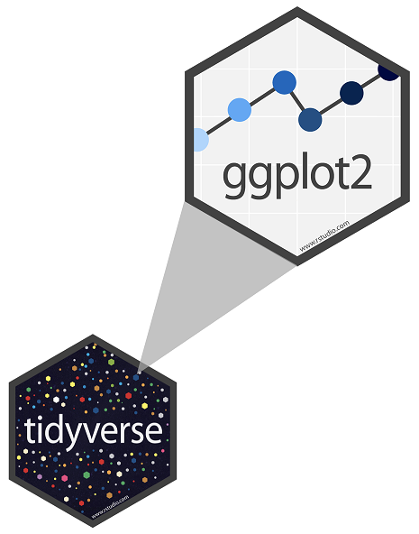

<!-- Add JavaScript code for making the exercise code larger -->
<script language="JavaScript" src="js/exercise-font-size.js"></script>

```{r setup, include=FALSE}

#devtools::install_github("ropenscilabs/icon",force=T)
#devtools::install_github("rundel/learnrhash")
remotes::install_github("rstudio/gradethis")

#load packages ---------------------------------

packages=c("tidyverse","learnr")
sapply(X=packages,FUN=function(x) if(!require(x,character.only=TRUE))  install.packages(x,dependencies=TRUE) )

library(learnr)
library(tidyverse)


#hide non exercise code chunks---------------

knitr::opts_chunk$set(echo = FALSE)


```

---

## Introduction 


**ggplot2** is tidyverse's data visualization package - The `gg` in "ggplot2" stands for Grammar of Graphics. It is inspired by the book **Grammar of Graphics** by Leland Wilkinson.

:::: {style="display:flex;"}

:::{}
```{r fig-ggplot-logo,fig.align="left"}



```
:::

:::{}


```{r fig-book,fig.align="right"}

knitr::include_graphics("images/grammar-of-graphics.png")

```
:::

::::


To use ggplot2 functions, begin by loading the **tidyverse** package by running the following code.


```{r load-packages, exercise=TRUE}
library(tidyverse)
```


## First steps 

Let's use our first graph to answer the question: do cars with bigger engines use more fuel than cars with smaller engines?  

`r fontawesome::fa("question-circle")` Intuitively, what do you think the relationship between engine size and gas mileage (mpg) looks like? Is it positive or negative? Linear or non-linear?

### The `mpg` dataframe

You can test your answer with the `mpg` **data frame** from the ggplot2 package. A data frame is a rectangular arrangement of variables (columns) and observations (rows). `mpg` contains observations collected by the U.S. Environmental Protection Agency on 38 popular models of car.

To see the `mpg` dataframe, type `mpg` in the code chunk below and click "Submit Answer"

```{r ex1, exercise=TRUE}


```


```{r how-many-cars}
question("How many cars are in the dataframe?",
         answer("38"),
         answer("234", correct=TRUE),
         answer("10"),
         answer("11") 
)
```


Among the variables in `mpg` are 

 - `displ`, a car's engine size in liters
 - `hwy`, a car's fuel efficiency on the highway in miles per gallon. 
 
 
 To see the *codebook* (description of variables) for `mpg`, type `?mpg` to open its help page.
```{r about-mpg, exercise=TRUE}

```
 

 
```{r what-is-drv}
 question("What does the variable `drv` describe?", 
  answer( "the type of drive train", correct=TRUE),
  answer("whether the car has a driver"),
  answer("the type of transmission"),
  answer("the type of car") 
)
  
```
  
### Creating a ggplot
 
 The following code creates a scatterplot with `displ` on the x-axis and `hwy` on the y-axis. 
 ```{r ex2, echo=T}
 ggplot(data=mpg, mapping=aes(x=displ,y=hwy)) + 
      geom_point()
 ```
 

 The plot shows a negative relationship between engine size (`displ`) and highway fuel efficiency (`hwy`) as one might expect. 
 
 Modify the code in the previous chunk to produce a scatter plot of the relationship between gas mileage for city driving (`cty`) and engine size (`displ`). Customize the plot to produce labels and a title.
 
```{r ex3, exercise=TRUE}
 
```

```{r ex3-solution}
ggplot(data=mpg, mapping=aes(x=displ,y=cty)) + 
      geom_point() + 
      labs(x="Engine size (liters)", 
           y="Miles driven per gallon",
           title="Fuel efficiency for city driving")
```
`r fontawesome::fa("question-circle")` How does the relationship between fuel efficiency and engine size change depending on city or highway driving? Look at the y-axis on both graphs. Also pay attention to the scatter of the points.
 
 
### Recap 
 
 With ggplot, you begin a plot with the function `ggplot()`. This creates a blank coordinate system. To this you add a layer of points using `geom`. `ggplot()` comes with many geom functions that each add a different layer to a plot. You can actually use multiple geoms in a single ggplot.
 
 The structure of the code for plots can be summarized as
 
```{r ggplot-structure, echo=T, eval=F}

#ggplot(data=[dataset], mapping = aes(x = [x-variable], 
#   y = [y-variable])) +
#   geom_xxx() +
#   other options`
```

 The `mapping` argument defines how variables in your data set are mapped to visual properties. The `mapping` argument is always paired with `aes()` which stands for aesthetics. An aesthetic is a visual property of the objects in your plot. Aesthetics include things like the font,size, the shape, or the color of your points. These things unfortunately can make a big difference! 
 
 ```{r fontsmatter, fig.margin = TRUE, fig.align="center",fig.width=2, out.width = "50%"}

```
 
 
The next section discusses the color input to the `mapping=aes()` argument which can greatly aid in understanding patterns in the data.


## Aesthetic mappings

In the plot between `hwy` and `displ` below, one group of points (highlighted in red) seems to fall outside of the linear trend between engine size and gas mileage. These cars have a higher mileage than you might expect for the size of their engine. 

`r fontawesome::fa("question-circle")` Why might this be happening?

```{r, fig.align='default'}
ggplot(data = mpg, mapping = aes(x = displ, y = hwy)) +
  geom_point() + 
  geom_point(data = dplyr::filter(mpg, displ > 5, hwy > 20), colour = "red", size = 2.2)
```

One possible answer is they might differ in some systematic way from the other cars. To investigate this, we might color-code the points according to a third variable: `class`.

For example, we can color a point green if it belongs to the compact class, blue if it belongs to the midsize class, and so on. 

Let's give this a try. Delete the underline in the code below and write `color = class` in its place. Run the code after removing the comment (`#`) symbols. What happens? 

```{r aesthetics, exercise = TRUE}
#ggplot(data = mpg,mapping = aes(x = displ, y = hwy, ___)) + 
#  geom_point()
```

The colors reveal that many of the unusual points in `mpg` are two-seater cars. These cars are in fact sports cars! Sports cars have large engines like SUVs and pickup trucks, but small bodies like midsize and compact cars, which improves their gas mileage. 

If we place any mappings in a geom layer, ggplot will treat them as local mappings for that layer only. For example, the following code will allow the color of just the points to vary by the type of car, but will not affect the color of the trend line.

```{r, echo=T,message=F}
ggplot(data=mpg, mapping=aes(x=displ,y=hwy)) + 
   geom_point(mapping=aes(color=class)) +
   geom_smooth()  
```


In the above example we mapped the color aesthetic of the points to the `class` variable from the data frame. This only makes sense to do since `class` takes a handful of distinct values.

It is important to keep in mind that we have barely scratched the surface of the customization offered by `ggplot()`. The best strategy is to add to your toolkit gradually as trying to learn it all is impossible.


## Getting Help

If you get stuck, start with Google. This strategy is particularly useful for error messages. Simply copy and paste the error message into your query.

If Google doesn’t help, try stackoverflow. Almost every question you have has been answered there.

And of course, you may ask your TAs or instructor for help.

## Facet Wrap

Color is one way to add an additional variable. But there is a lot of overlap between the points belonging to the different classes. It would be nice to see the classes side by side rather than on the same plot. Fortunately, ggplot has a way to split the plot into facets or subplots, each of which displays a separate set of data.

To facet a scatter plot by one variable, we use facet_wrap(). The only required argument is the first one which specifies the facet variable. Optional arguments may be used to customize the number of rows, number of columns, labels and so on.

```{r ex5, echo=T}
ggplot(data=mpg, mapping=aes(x=displ,hwy)) + 
   geom_point() +
    facet_wrap(~class, nrow=2)
```


`r fontawesome::fa("question-circle")` What are the advantages of using faceting instead of the color aesthetic? Disadvantages?

## Geometric Objects

A `geom` is a geometric object which represents the data. To put it simply, `geom` tells ggplot what type of graph we want. Some examples we have seen in class are: `geom_histogram`, `geom_density` and `geom_boxplot`. 

For example, the following code produces a density plot of highway fuel efficiency categorized by the drive train 

```{r histo-hwy}
ggplot(data=mpg,mapping=aes(x=hwy,fill=drv))+
  geom_density(adjust=2,alpha=0.5)+
  labs(x="miles per gallon",
       y="Density",
       title="Fuel efficiency on the highway",
       fill="Drive train")

```

The picture shows that cars with front wheel drive have a much higher fuel efficiency than rear wheel or 4 wheel. Does this pattern hold up for city driving as well? 

Type in the code to produce a density plot for `cty` with `drv` as the fill variable.

```{r ex6, exercise=TRUE}


```

```{r ex6-solution}
ggplot(data=mpg,mapping=aes(x=cty,fill=drv))+
  geom_density(adjust=2,alpha=0.5)+
  labs(x="miles per gallon",
       y="Density",
       title="Fuel efficiency for city driving",
       fill="Drive train")

```


Another useful `geom` is the boxplot. The following code creates a boxplot to compare the engine size `displ` across the `class` of car. 

```{r engine-trans}

ggplot(data=mpg,mapping=aes(x=displ,y=class) )+
  geom_boxplot()
```


## Setting versus Mapping Aesthetics

We refer to linking an aesthetic such as color to a variable as **mapping**. There are times however where we simply want to **set** the aesthetic to something. For instance, maybe we want all our points in a scatterplot to be square in shape . This is done in the relevant layer of the ggplot function using `shape=15`, but outside the `mapping` argument. 

```{r ex10, echo=T}
ggplot(data=mpg,mapping=aes(x=displ,y=hwy)) + 
   geom_point(mapping=aes(color=class), shape=15) 
```


## Common Mistakes

1.One common problem when creating ggplot graphics is to put the + in the wrong place. It has to come at the end of the line, not at the start.

2.Remember that R is case sensitive. Be sure to write variable names exactly as they appear.


## Application Exercise

Now that you have a few tricks under your belt, let’s use them on a different dataframe. The `` data is a preloaded dataset that comes with R. It gives measurements taken on 50 flowers from each of 3 species of iris.

1.How can you learn more about the data set and its contents?

```{r ex8, exercise=TRUE}
##
##
```

2.Make a scatterplot showing the sepal length against sepal width. Allow the color of the points to vary by Species. Also draw a smooth trend line. Vary the color of the points (but not the trend line) by `Species`.

```{r ex9, exercise=TRUE, exercise.lines=5}
##
##
```


```{r ex9-solution}
ggplot(data=iris,mapping=aes(x=Sepal.Width,y=Sepal.Length))+ 
 geom_point(mapping=aes(color=Species))+
  geom_smooth()
```


`r fontawesome::fa("question-circle")` How might you describe the relationship between sepal length and width?

3. Facet the scatter plot in part 2 by Species. 

```{r ex11, exercise=TRUE, exercise.lines=5}
##

```

```{r ex11-solution}

ggplot(data=iris,mapping=aes(x=Sepal.Width,y=Sepal.Length)) +
   geom_point()+
  facet_wrap(~Species),nrow=1) 
```
## Wrap Up

Congratulations on making it through this very brisk introduction to ggplot! There is tons more you could do with ggplot; the key is to keep trying and learning.


## Acknowledgements


This tutorial is excerpted from _R for Data Science_ by Hadley Wickham and Garrett Grolemund, published by O’Reilly Media, Inc., 2016, ISBN: 9781491910399. You can purchase the book at [shop.oreilly.com](http://shop.oreilly.com/product/0636920034407.do).

The R code for creating this learnr tutorial was also greatly informed by the learnr tutorials in  RStudio Cloud's primers found [here](https://github.com/rstudio-education/primers).


