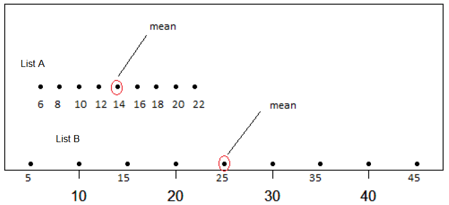

```{r setup, include = FALSE}

library(tidyverse)
library(openintro)
library(grid)
library(gapminder)
library(learnr)
library(gt)
library(stringr)
library(patchwork)

knitr::opts_chunk$set(warning = FALSE,
                      message = FALSE,
                      echo = FALSE, 
                      fig.height = 3,
                      fig.width = 5,
                      fig.align = "center")

life <- read.csv(url("https://raw.githubusercontent.com/OpenIntroStat/ims-tutorials/master/02-summarizing-and-visualizing-data/03-lesson/data/life_exp.csv")) %>% 
  mutate(
    state = str_to_title(state),
    county = str_to_title(county)
   )
```

## Measures of center

What do we mean by a typical observation? For example, it sounds perfectly fine to state a statistic like: the typical life expectancy in the US is 77.6 years, but where does that number come from? Before we answer that question, let's make this more concrete by introducing a dataset that we'll be working with throughout the lesson.

### County demographics

Researchers in public health have compiled data on the demographics of every county in the US. We see here that we have 4 variables: the state name, the county name, then the average life expectancy, and the median income. Let's focus on the life expectancy in the first 11 counties in this dataset, all in the state of Alabama.


```{r life}
life
```


### Center: mean

We're going to simplify and extract those 11 numbers by rounding the values of expectancy, when looking at the first 11 cases. The result, x, is 11 integers, all in the mid 70s.

OK, so let's ask the question again: what is a typical value for this set of 11 numbers?

```{r xlife}
x <- head(round(life$expectancy), 11)
x
```

```{r baseplot}
x <- head(round(life$expectancy), 11)
x <-  data.frame(x)
# base plot
ggplot(data = x, aes(x = x)) +
  geom_dotplot(binwidth = 0.75,dotsize=0.2) +
  theme(legend.position = "none",
        axis.text.y = element_blank(),
        axis.title.y = element_blank())
x <- x$x
```

The most common answer is the mean, which is the sum of all of the observations divided by the number of observations. We learn that the mean life expectancy in these 11 counties is around 74.5 years. We can also use the built-in function mean.

```{r sum}
sum(x)/11
```

```{r mean, echo=T}
mean(x)
```

If we visualize "x" as a dot plot, we can represent the mean as a vertical red line.
Another measure of "typical" or "center" is the median.

```{r plot1}
x <- head(round(life$expectancy), 11)
x <-  data.frame(x)
# base plot
ggplot(data = x, aes(x = x)) +
  geom_dotplot(binwidth = 0.75,dotsize=0.2) +
  theme(legend.position = "none",
        axis.text.y = element_blank(),
        axis.title.y = element_blank())+
  geom_vline(xintercept = mean(x$x), color = "red", lwd = 1)
x <- x$x
```

### Center: mean, median

The median is the middle value in the sorted dataset. It's also known as the 50th percentile of the distribution. So if we sort x, the middle value is 74. We can also use the built-in function median. Let's draw that line in blue.

```{r sort, echo = TRUE}
sort(x)
```

```{r median,echo=T}
median(x)
```

```{r plot2}
x <- head(round(life$expectancy), 11)
x <-  data.frame(x)
# base plot
ggplot(data = x, aes(x = x)) +
  geom_dotplot(binwidth = 0.75,dotsize=0.2) +
  theme(legend.position = "none",
        axis.text.y = element_blank(),
        axis.title.y = element_blank())+
  geom_vline(xintercept = mean(x$x), color = "red", lwd = 1)+
  geom_vline(xintercept = median(x$x), color = "blue", lwd = 1)
```

The mean can be thought of as the balance point of the data and it tends to be drawn towards the longer tail of a distribution. This highlights an important feature of the mean: its sensitivity to extreme values. For this reason, when working with skewed distributions, the median is often a more appropriate measure of center.

### Center: mean, median, mode


A third measure of center is the mode.

The mode is simply the most common observation in the set. We can look at the dot plot and see that it is 74.

```{r plot3}
x <- head(round(life$expectancy), 11)
x <-  data.frame(x)
# base plot
ggplot(data = x, aes(x = x)) +
  geom_dotplot(binwidth = 0.75,dotsize=0.2) +
  theme(legend.position = "none",
        axis.text.y = element_blank(),
        axis.title.y = element_blank())+
  geom_vline(xintercept = mean(x$x), color = "red", lwd = 1)+
  geom_vline(xintercept = median(x$x), color = "blue", lwd = 1)+
  geom_vline(xintercept = 74.01, color = "yellow", lwd = 1)
x <- x$x
```

 We can also run the table function to see that the greatest count was 3 at 74. Let's plot the mode right next to the median in gold.

```{r table, echo=T}
table(x)
```

Now that we have some sensible measures of center, we can answer questions like: is the typical county life expectancy on the West Coast similar to the typical life expectancy in the rest of the country?


### Groupwise means

To answer this, we start by creating a new variable that will be TRUE if the state value is one of "California", "Oregon", or "Washington", and FALSE otherwise, and save it back to the original dataset. 

```{r life-mutate}
life <- life %>%
  mutate(west_coast = state %in% c("California", "Oregon", "Washington"))
```

To compute groupwise means, we pipe the dataset into the `group_by()` function indicating that we'd like to establish groups based on our new variable. Then we can `summarize()` those groups, West Coast counties and non-West Coast counties, by taking the `mean()` and `median()` of their life expectancies. The result is shown below.

```{r life-groupby}
life %>%
  group_by(west_coast) %>%
  summarize(mean(expectancy),
            median(expectancy))
```

We learn that looking at both mean and median, the typical West Coast county has a slightly higher average life expectancy than counties not on the West Coast.

### Without `group_by()`

`group_by()` and `summarize()` form a powerful pair of functions, so let's look into how they work. Let's look at a slice of 8 rows in the middle of the dataset.


```{r life-slice-styled}
life %>%
  slice(240:247) %>%
  gt() %>%
  tab_style(
    style = list(
      cell_fill(color = COL[2,4]),
      cell_text(weight = "bold")
      ),
    locations = cells_body(
      columns = vars(expectancy))
  )
```


We can `summarize()` the expectancy variable by taking its `mean()` across all 8 rows.

```{r life-summarize}
life %>%
  slice(240:247) %>%
  summarize(mean(expectancy))
```

### With `group_by()`

If we add a line to group by the west coast, it's effectively breaking the dataset into two groups and calculating the `mean()` of the expectancy variable for each one separately.

```{r life-gr-sum-gt,}
life %>%
  slice(240:247) %>%
  gt() %>%
  tab_style(
    style = list(
      cell_fill(color = "lightyellow"),
      cell_text(weight = "bold")
      ),
    locations = cells_body(
      columns = vars(expectancy),
      rows = west_coast == TRUE)
  ) %>%
    tab_style(
    style = list(
      cell_fill(color = "lightcyan"),
      cell_text(weight = "bold")
      ),
    locations = cells_body(
      columns = vars(expectancy),
      rows = west_coast == FALSE)
  )
```

```{r life-gr-sum}
life %>%
  slice(240:247) %>%
  group_by(west_coast) %>%
  summarize(mean(expectancy))
```

As seen in the example above, `group_by()` and `summarize()` open up lots of possibilities for analysis, so let's get started.


### Choice of center measure

The choice of measure for center can have a dramatic impact on what we consider to be a typical observation, so it is important that you consider the shape of the distribution before deciding on the measure.

```{r mc1-pre,eval=F,echo=F}
set.seed(38)
rskew <- rexp(1000, 1)
symm <- rnormmix(n=1000,lambda=c(0.5,0.5),mu=c(-2,2),sigma=c(1,1))
d <- data.frame(x = c(rskew, symm),
                distribution = rep(c("A", "B"), c(1000, 1000)))
ggplot(d, aes(x = x, fill = distribution)) +
  geom_density(alpha = 0.3)
```

```{r mc1}
question("A track coach wants to determine an appropriate heart rate for an average athlete during their workouts. She chooses five of her runners and asks them to wear heart monitors. In the middle of the workout, she reads the following heart rates for the five athletes: 130, 135, 140, 145, 325. Which of the following is an appropriate measure of center for this data?",
  answer("Mean", message = "Not quite, that outlier is a doozy! Try again."),
  answer("Median", correct = TRUE, message = "Nice! Let's continue to the next exercise."),
  answer("Mode", message = "Not quite, there are no repeats in this dataset. try again."),
  allow_retry = TRUE
)
```


### Calculate center measures

In this exercise, we will use the `gapminder` dataframe, which tracks demographic data in 142 countries of the world over time. To learn more about it, you can get help by running the code chunk below. You can also type `head(gapminder)` to look at the first few records.

```{r about-gap-data,exercise=TRUE, eval=TRUE}
?gapminder
```

We will focus on how the life expectancy differs from continent to continent. This requires that you conduct your analysis not at the country level, but aggregated up to the continent level. This is made possible by the one-two punch of `group_by()` and `summarize()`.


- Create a dataset called `gap2007` that contains only data from the year 2007.
- Using `gap2007`, calculate the mean and median life expectancy (`lifeExp`) for each continent. Don't worry about naming the new columns produced by `summarize()`.
- Confirm the trends that you see in the medians by generating side-by-side box plots of life expectancy for each continent.

```{r ex1, exercise = TRUE}
# Create dataset of 2007 data

gap2007 <- gapminder %>% filter()

# Compute groupwise mean and median lifeExp
gap2007 %>%
 group_by() %>%
  summarize()

# Generate box plots of lifeExp for each continent
gap2007 %>%
  ggplot() + 
  geom_boxplot()

```

<div id="ex1-hint">
**Hint:** In order to calculate the average life expectancy for each continent we need to first group the data by `continent` and then use the `summarize()` function to calculate the `mean()`.
</div>

```{r ex1-solution}
# Create dataset of 2007 data
gap2007 <- gapminder %>% filter(year == 2007)

# Compute groupwise mean and median lifeExp
gap2007 %>%
  group_by(continent) %>%
  summarize(mean(lifeExp),
            median(lifeExp))

# Generate box plots of lifeExp for each continent
gap2007 %>%
  ggplot(mapping=aes(x = continent, y = lifeExp)) +
  geom_boxplot()

```


## Measures of variability

How do you summarize the typical variability that you see in a set of numbers?

Let's consider the life expectancies in those first 11 counties in the US county-level dataset, which we saved to the object x. Most methods have us thinking about variability along the lines of how much the data is spread out from the center.

```{r x, echo = TRUE}
x
```

```{r plotdots}
x <- head(round(life$expectancy), 11)
x <- data.frame(x)
# base plot
ggplot(data = x, aes(x = x)) +
  geom_dotplot(binwidth = 0.2,dotsize=0.5) +
  theme(legend.position = "none",
        axis.text.y = element_blank(),
        axis.title.y = element_blank())
x <- x$x
```


Let's choose to define the center by the mean and then, quantify the distance from the mean by taking the difference between each observation and that mean. 

```{r plotdots1}
x <- head(round(life$expectancy), 11)
x <-  data.frame(x)
# base plot
ggplot(data = x, aes(x = x)) +
  geom_dotplot(binwidth = 0.2,dotsize=0.5) +
  theme(legend.position = "none",
        axis.text.y = element_blank(),
        axis.title.y = element_blank())+
  geom_vline(xintercept = mean(x$x), color = "red", lwd = 1)
x <- x$x
```

That results in 11 differences, some positive, some negative. 

```{r x1, echo = TRUE}
x - mean(x)
```

We'd like to reduce all of these differences to a single measure of variability, so let's add them up. This is R's scientific notation, saying the sum is -1.42 times 10 to the -14. That number is essentially zero.

```{r x2, echo = TRUE}
sum(x - mean(x))
```

Clearly something has gone wrong because we can tell that there is variability in this dataset, but our measure hasn't detected it. The problem is that the positives and negatives have canceled each other out. This is easy to fix: you can square each difference to get rid of the negatives.


```{r x3, echo = TRUE}
sum((x - mean(x))^2)
```


The new measure is better, but it has an undesirable property: it will just keep getting bigger the more data that you add. You can fix the unconstrained growth by dividing the new measure by the number of observations, 11. Now, the quantity is a useful measure found by the following steps: find the center of the data, then find the squared distance between the observations, and averaged across whole dataset.


```{r x4, echo = TRUE}
n <- 11
sum((x - mean(x))^2)/n
```


If you change the n to an n-1, you are left with what's called the *sample variance*, one of the most useful measures of the spread of a distribution. 

```{r x5, echo = TRUE}
sum((x - mean(x))^2)/(n - 1)
```

In R, this statistic is wrapped up into the function `var()` for *variance*.


```{r x6, echo = TRUE}
var(x)
```


Another useful measure is the square root of the *sample variance*, which is called the *sample standard deviation* or just `sd()` in R. The convenient thing about the sample standard deviation is that, once computed, it is in the same units as the original data. In this case we can say that the standard deviation of the 11 counties' life expectancies is 1.69 years. 


```{r sd, echo = TRUE}
sd(x) # Standard deviation
```

By comparison, the variance of this sample is 2.87 years squared, which is a unit that we have no real intuition about.

```{r var, echo = TRUE}
var(x) # Variance
```

There are two more measures of spread that are good to know about. The interquartile range, or IQR, is the distance between the two numbers that cut-off the middle 50% of your data. This should sound familiar from the discussion of box plots: the height of the box is exactly the IQR. We can either get the first and third quartiles from the summary function and take their difference or we can use the built-in IQR function.

```{r summary, echo = TRUE}
summary(x)
```


```{r iqr, echo = TRUE}
IQR(x) # Interquartile range
```

The final measure is simply the range of the data: the distance between the maximum and the minimum. max and min are indeed functions in R, but you can also use the nested diffrangex.

```{r difran, echo = TRUE}
diff(range(x)) # Range
```

### Robustness properties 

For any dataset, you can compute all four of these statistics, but which ones are the most meaningful? The most commonly used in practice is the standard deviation, so that's often a good place to start. But what happens if the dataset has some extreme observations?

```{r img14}
x[2] <- 97
x_new <- x
```

Let's say that Baldwin County, Alabama, the county with a life expectancy around 78, instead had a life expectancy of 97. 

```{r x-new,}
x_new <- data.frame(x_new)
# base plot
ggplot(data = x_new, aes(x = x)) +
  geom_dotplot(binwidth = 0.5) +
  theme(legend.position = "none",
        axis.text.y = element_blank(),
        axis.title.y = element_blank())
x_new <- x_new$x_new
```

```{r out}
x_new
```

If you recompute the variance and the standard deviation, you see that they've both gone through the roof. These measures are sensitive to extreme values in the same way that the mean is as a measure of center. 


```{r new2}
var(x_new) 
```

```{r new3}
sd(x_new) 
```

If you recompute the range, it will certainly increase because it is completely determined by the extreme values. For this reason, the range is not often used.

```{r new4, eval=FALSE, include=TRUE}
diff(range(x_new))
```


If you recompute the IQR, however, you see that it hasn't budged. Because that observation is still the highest, the quartiles didn't move. This reveals a good reason for using the IQR: in situations where your dataset is heavily skewed or has extreme observations.

```{r new5}
IQR(x_new) 
```

### Choice of spread measure

The choice of measure for spread can dramatically impact how variable we consider our data to be, so it is important that you consider the shape of the distribution before deciding on the measure.


```{r mc2-pre}
rskew <- rexp(1000, 1)
symm <- rnorm(1000)
d <- data.frame(x = c(rskew, symm),
                distribution = rep(c("A", "B"), c(1000, 1000)))
ggplot(d, aes(x = x, fill = distribution)) +
  geom_density(alpha = 0.3)
```


```{r mc2}
question("Which set of measures of spread would be *worst* for describing the two distributions shown here?",
  answer("A: IQR, B: IQR", message = "Given the two distributions, the IQR seems like it'd be okay."),
  answer("A: SD, B: IQR", message = "Hm, not quite. Try again!"),
  answer("A: Variance, B: Range", correct = TRUE, message = "Good job!" ), 
  incorrect = "A has a high peak and its width is large. What does that tell you about its spread?",
  allow_retry = TRUE
)
```


```{r mc5-pre}


```

```{r mc5}
question("Which list of numbers, A or B, has a standard deviation of about 5?",
  answer("A", correct=TRUE, message = "Great! Some deviations are less than 5 and some larger than 5, which makes this a good guess"),
  answer("B", message = "Not quite, the deviations are typically much larger than 5"),
  allow_retry = TRUE
)
```

### Calculate spread measures

Let's extend the powerful `group_by()` and `summarize()` syntax to measures of spread. If you're unsure whether you're working with symmetric or skewed distributions, it's a good idea to consider a robust measure like IQR in addition to the usual measures of variance or standard deviation.


The `gap2007` dataset that you created in an earlier exercise is available in your workspace.

- For each continent in `gap2007`, summarize life expectancies using the `sd()`, the `IQR()`, and the count of countries, `n()`. No need to name the new columns produced here. The `n()` function within your `summarize()` call does not take any arguments.


```{r ex2-setup}
gap2007 <- filter(gapminder, year == 2007)
```

```{r ex2, exercise = TRUE}
# Compute groupwise measures of spread
gap2007 %>%
  group_by() %>%
  summarize()
```

```{r ex2-hint-1}
# Compute groupwise measures of spread
gap2007 %>%
  group_by(continent) %>%
  summarize()

```


```{r ex2-solution}
# Compute groupwise measures of spread
gap2007 %>%
  group_by(continent) %>%
  summarize(sd(lifeExp),
            IQR(lifeExp),
            n())

```

## Application Exercise 

Using the shapes of the density plots, calculate the most appropriate measures of center and spread for the distribution of life expectancy in the Americas:

```{r shape-america,fig.width=5,fig.height=5}
gap2007 <- filter(gapminder, year == 2007)

gap2007 %>%
  ggplot(aes(x = lifeExp)) +
  geom_density(alpha=0.3) +
  facet_wrap(facets=vars(continent))+
  ggtitle("Life Expectancy in Continents Around the World")

```


```{r ex3-setup}
gap2007 <- filter(gapminder, year == 2007)

gap2007 %>%
  filter(continent == "Americas") %>%
  ggplot(aes(x = lifeExp)) +
  geom_density() +
  ggtitle("Life Expectancy in the Americas")
# skewed

```

```{r ex3, exercise = TRUE}
# Compute stats for lifeExp in Americas


gap2007 %>%
  filter() %>%
  summarize()


```


```{r ex3-hint-1}
# Compute stats for lifeExp in Americas
gap2007 %>%
  filter(continent == "Americas") %>%
  summarize()

```

```{r ex3-solution}
# Compute stats for lifeExp in Americas
gap2007 %>%
  filter(continent == "Americas") %>%
  summarize(mean(lifeExp),
            sd(lifeExp))

```


## Congratulations!

You have successfully completed this tutorial!

## Acknowledgments

This tutorial has been excerpted from OpenIntro::Introduction to Modern Statistics Tutorials.
