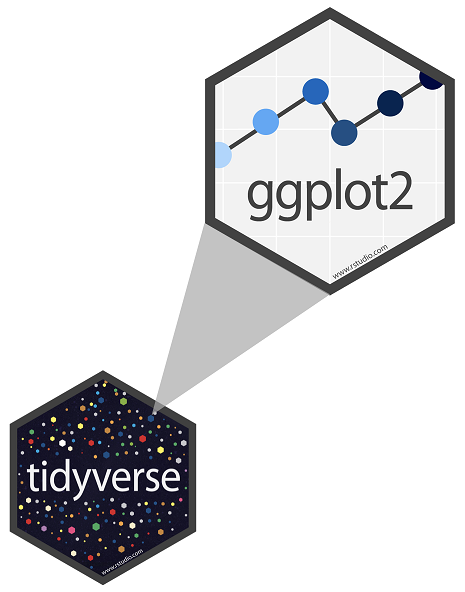
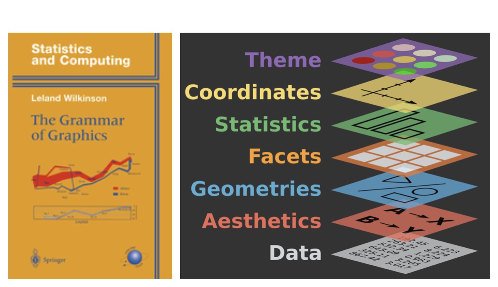
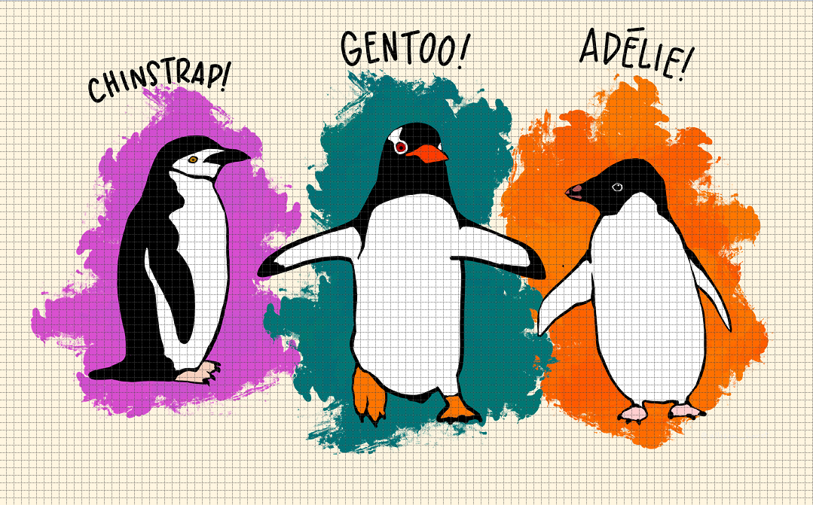
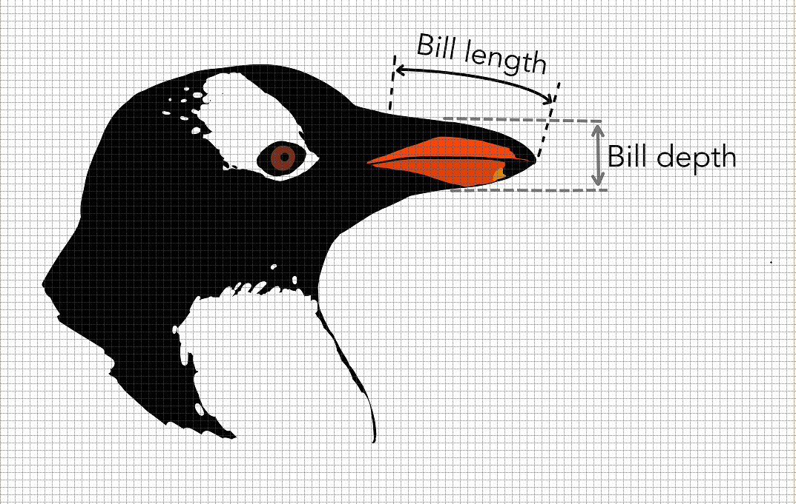

```{r setup, include=FALSE}

#load packages ---------------------------------

library(learnr)
library(tidyverse)
library(palmerpenguins)
library(gradethis)


#hide non exercise code chunks---------------

knitr::opts_chunk$set(echo = FALSE)


# set options for exercises and checking ---------------------------------------
gradethis_setup()
```

---

## Introduction 

**ggplot2** is tidyverse's data visualization package - The `gg` in "ggplot2" stands for Grammar of Graphics because the package is inspired by a similarly titled book written by Leland Wilkinson. The book develops a grammar for graphics that enable us to concisely describe the components of a graphic. Specifically, each component is thought of as a layer which gets added on.

:::: {style="display:flex;"}

:::{}
```{r fig-ggplot-logo,fig.align="left"}



```
:::

:::{}


```{r fig-book,fig.align="right"}



```
:::

::::


To use ggplot2 functions, we need to begin by loading the **tidyverse** package. Run the following code and then click "Submit Answer".


```{r load-packages, exercise=TRUE}
library(tidyverse)
```

```{r load-packages-solution}
library(tidyverse)
```

```{r load-packages-check}
grade_this_code("The packages are now loaded!")
```

## The Data

For this tutorial, we will use the `mpg` dataframe from the `ggplot2` package. To see the `mpg` dataframe, type `mpg` in the code chunk below and click "Run Code"

```{r ex1, exercise=TRUE}

```


```{r how-many-cars}
question("How many cars are in the dataframe?",
         answer("38"),
         answer("234", correct=TRUE),
         answer("10"),
         answer("11") 
)
```


Among the variables in `mpg` are 

 - `displ`, engine displacement, in liters
 - `hwy`,  fuel efficiency on the highway in miles per gallon. 
 

To see the *codebook* (description of variables) for `mpg`, type `?mpg` which should open its help page in a new browser tab.

```{r about-mpg, exercise=TRUE}

```
 

 
```{r what-is-drv}
 question("What does the variable `drv` describe?", 
  answer( "whether a car has a 4 wheel, or front wheel or rear wheel drive train", correct=TRUE),
  answer("whether the car has a driver"),
  answer("whether a car has manual or automatic transmission"),
  answer("the type of car") 
)
  
```
## The Grammer of Graphics 
 
With ggplot, we begin a plot with the data frame. This creates a blank coordinate system. 

The `mapping` argument which comes next defines how variables in your data set are mapped to visual properties. The `mapping` argument is always paired with `aes()` which stands for *aes*thetics. Aesthetics include $x$, $y$, as well as things like the size, shape, and color of your points and much more.

The next layer is the `geom` which specifies the type of graph you wish to create. `ggplot()` comes with many geom functions that each build a different plot. You can actually use multiple geoms in a single ggplot.
 
 The structure of the code for plots can be summarized as
 
```{r ggplot-structure, echo=T, eval=F}

ggplot(data=[dataset], 
      mapping = aes(x = [x-variable], y = [y-variable])) +
   geom_xxx() +
   other options`
```

 
We can omit the names of the first two arguments when building plots with ggplot as shown below. 

```{r ggplot-structure-omit, echo=T, eval=F}

ggplot([dataset], 
        aes([x-variable], [y-variable])) +
   geom_xxx() +
   other options`
```


However, I prefer not to omit names and will encourage you to do the same. 


### Are cars with bigger engines less fuel efficient?

Let's create a plot to examine the relationship between engine size (`displ`) and fuel economy. The following code creates a scatter plot with `displ` on the x-axis and highway miles per gallon (`hwy`) on the y-axis. I have also created descriptive axis labels and titles using the `labs` layer.


```{r ex2, echo=T}
 ggplot(data=mpg, 
       mapping=aes(x=displ,y=hwy)) + 
      geom_point() +
      labs(x="Engine displacement (liters)",
           y="Miles per gallon",
           title="Fuel economy versus engine size",
           subtitle="Data for highway driving",
           caption="Source: mpg data from ggplot2 package")
```
 

 The plot shows a negative relationship between engine size (`displ`) and highway fuel efficiency (`hwy`) as one might expect. 
 
 Type code in the code chunk below to produce a scatter plot of the city miles per gallon (`cty`) and engine size (`displ`). Customize the plot as above to produce labels for the axes and a title.
 
```{r cty-displ-plot, exercise=TRUE}

```

```{r cty-displ-plot-hint}
#code out loud:
# - start with the mpg data frame
# - map displ to the x-axis and  the y-axis
# - represent each observation with a point and 
# - give the plot a title, subtitle, axis labels 
```

```{r cty-displ-plot-solution}
ggplot(data=mpg, mapping=aes(x=displ,y=cty)) + 
      geom_point() + 
      labs(x="Engine size (liters)",
           y="Miles per gallon",
           title="Fuel economy versus engine size",
           subtitle="Data for city driving",
           caption="Source: mpg data from ggplot2 package")
```


Next, we will consider adding some color to our plot which can greatly help with understanding patterns in the data.

### Color coding points

In both the scatter plots of the previous section , one group of cars (shown  below) have a higher mileage than you might expect for the size of their engine. 


:::: {style="display:flex;"}

:::{}
```{r fig-hwy,fig.align="center", out.width="80%"}
ggplot(data=mpg, 
       mapping=aes(x=displ,y=hwy)) + 
      geom_point()+
      geom_point(data=mpg%>% filter(displ > 5, hwy > 20),
          mapping=aes(x=displ,y=hwy),pch=21,col="red",size=4,stroke=1)+
      labs(x="Engine displacement (liters)",
           y="Miles per gallon",
           title="Fuel economy versus engine size",
           subtitle="Data for highway driving",
           caption="Source: mpg data from ggplot2 package")
```
:::

:::{}


```{r fig-cty,fig.align="center",out.width="80%"}
ggplot(data=mpg, 
       mapping=aes(x=displ,y=cty)) + 
      geom_point()+
       geom_point(data=mpg %>% 
                    filter((displ > 5& cty >= 15)|
                            (displ> 6 & cty > 13)),
        mapping=aes(x=displ,y=cty),
        pch=21,col="red",size=4,stroke=1)+
      labs(x="Engine displacement (liters)",
           y="Miles per gallon",
           title="Fuel economy versus engine size",
           subtitle="Data for city driving",
           caption="Source: mpg data from ggplot2 package")

```
:::

::::


A possible reason for this is they differ in some systematic way from the other cars. To investigate this, let's color-code the points by the `class` of the car. For example, we can color a point green if it belongs to the compact class, blue if it belongs to the midsize class, and so on. 

Give this a try. Delete the underline in the code below and write `color = class` in its place. Run the code after removing the comment (`#`) symbols. What happens? 

```{r color-aesthetics, exercise = TRUE}
#ggplot(data = mpg,
#      mapping = aes(x = displ, y = hwy, ___ )) + 
#  geom_point()+
#  scale_color_viridis_d()
```

The colors reveal that many of the unusual points in the scatter plots are two-seater cars. These cars are in fact sports cars! Sports cars have large engines like SUVs and pickup trucks, but small bodies like midsize and compact cars, which improves their gas mileage. 


Note that we have also added a `scale` layer to the ggplot code. Scales control the mapping from the data to your aesthetics. An important property of ggplot2 is that **every** aesthetic in your plot is associated with exactly one scale.

For example, when we write

```{r, echo=T, eval=F}
ggplot(data = mpg, mapping= aes(x=displ, y=hwy, color=class)) + 
  geom_point()
```

ggplot2 added a default scale for each aesthetic behind the scenes. 

```{r, echo=T, eval=F}
ggplot(data = mpg, 
       mapping= aes(x=displ, y=hwy, color=class)) + 
  geom_point()+
  scale_x_continuous()+
  scale_y_continuous()+
  scale_color_discrete()

```
The choice of default scale depends on the aesthetic and variable type. For example, `hwy` is a numerical variable mapped to the y aesthetic, so the default scale is `scale_y_continuous()`. Similarly `class` is a categorical variable, so when mapped to the color aesthetic the default scale becomes discrete.

If we want to over-ride the default scale, we will need to add it ourselves as we did for the color palette. The viridis color scheme is designed to be perceived by viewers with common forms of color blindness and is therefore a much better choice than the default.


If we place any mappings in a geom layer, ggplot will treat them as local mappings for that layer only. For example, the following code will allow the color of just the points to vary by the type of car, but will not affect the color of the trend line that we add to the plot.

```{r color-local-mapping, exercise=TRUE}
ggplot(data=mpg, 
       mapping=aes(x=displ,y=hwy)) + 
   geom_point(mapping=aes(color=class)) +
   geom_smooth()  + 
  scale_color_viridis_d()
```


### Faceting a plot

Color is one way to add an additional variable. But there is a lot of overlap between the points belonging to the different classes. It would be nice to see the classes side by side rather than on the same plot. Fortunately, ggplot has a way to split the plot into facets or subplots, each of which displays a subset of data. This can be useful for exploring conditional relationships, especially in big data sets.

To facet a scatter plot by one variable, we use `facet_wrap()`. The only required argument is the first one which specifies the facet variable. Optional arguments may be used to customize the number of rows, number of columns, labels and so on.

Run the following code to examine the relationship between `hwy` and `displ` by the type of fuel `fl` used in the vehicle. 

```{r displ-hwy-class-facet, exercise=T}
ggplot(data=mpg, 
       mapping=aes( x=displ, y=hwy)) + 
   geom_point() +
    facet_wrap(~ fl)
```

To facet by 2 variables, it is best to use `facet_grid` which has a slightly different syntax `facet_grid( rows ~ cols)`. 

Create a plot of the relationship between `hwy` and `displ` which is faceted by the type of drive train `drv` and the type of fuel `fl`

```{r displ-hwy-facet-grid, exercise=TRUE}


```

```{r displ-hwy-facet-grid-hint-1}
ggplot(data=mpg, 
       mapping=aes( x=displ, y=hwy )) 

```

```{r displ-hwy-facet-grid-hint-2}
ggplot(data=mpg, 
       mapping=aes( x=displ, y=hwy )) + 
   geom_point() 
```

```{r displ-hwy-facet-grid-hint-3}
ggplot(data=mpg, 
       mapping=aes( x=displ, y=hwy )) + 
   geom_point() +
   facet_grid( ) 
```

```{r displ-hwy-facet-grid-solution}
ggplot(data=mpg, 
       mapping=aes( x=displ, y=hwy )) + 
   geom_point() +
    facet_grid(drv ~ fl)

```

### Setting versus Mapping Aesthetics

We refer to linking an aesthetic such as color or fill to a variable as **mapping** the aesthetic. 

There are times however where we simply want to **set** the aesthetic to something. 

For instance, maybe we want all our points in a scatter plot to be red. This is done in the relevant layer of the ggplot function using `color="red"`. 

```{r set-aes, exercise=TRUE}
ggplot(data=mpg,
       mapping=aes(x=displ,y=hwy)) + 
   geom_point(color="red")
```


### Geometric Objects

A `geom` is a geometric object which represents the data. To put it simply, `geom` tells ggplot what type of graph we want. So far, we have looked at `geom_point` where the geometric object being plotted is a point. Some other useful examples are: `geom_histogram`, `geom_density` and `geom_boxplot`. 

For example, the following code produces a density plot of highway fuel efficiency categorized by the drive train. Each `geom` has a list of arguments, some of which are unique to it. For example, the `adjust` in `geom_density` determines the smoothing window in much the same way as `binwidth` for a histogram.  

```{r histo-hwy, echo=T}
ggplot(data=mpg,
       mapping=aes(x=hwy,fill=drv))+
  geom_density(adjust=2,alpha=0.5)

```

When the `geom` is an object that has area, as with a density curve, the color aesthetic would simply apply to the outline of the shape. To fill in the shape with color, we need to use `fill` rather than `color`. 


Type in the code to produce a density plot for `cty` with `fl` as the fill variable. Play around with the bandwidth parameter `adjust` to see how it affects the density plot. 

```{r ex6, exercise=TRUE}


```

```{r ex6-solution}
ggplot(data=mpg,mapping=aes(x=cty,fill=fl))+
  geom_density(adjust=2,alpha=0.5)+
  labs(x="miles per gallon",
       y="Density",
       title="Fuel efficiency for city driving",
       fill="Drive train")

```


Another useful `geom` is the boxplot. The following code creates a boxplot to compare the engine size `displ` by type of transmission `trans`. 
```{r engine-trans, exercise=TRUE}

ggplot(data=mpg,
       mapping=aes(x=displ,fill=trans) )+
  geom_boxplot()
```


## Common Mistakes

1.One common problem when creating ggplot graphics is to put the + in the wrong place. It has to come at the end of the line, not at the start.

2.Remember that R is case sensitive. Be sure to write variable names exactly as they appear.


## Palmer Penguins

Now that you have a few tricks under your belt, let’s use them on a different dataframe. The `penguins` data frame contains size measurements for three penguin species living on islands in the Palmer archipelago. The data is part of the `palmerpenguins` package. 

:::: {style="display:flex;"}

:::{}
```{r penguin-fig-1,fig.align="center",out.width="75%"}



```
:::

:::{}


```{r penguin-fig-2,fig.align="center",out.width="75%"}


```
:::

::::


Load the package and take a quick peek at the data and view its dimensions by running the code below.

```{r load-penguin-data, exercise=TRUE}
library(palmerpenguins)
glimpse(penguins)

```


1. Recreate the following plot.

```{r, message=F,warning=F}
ggplot(data = penguins,
       mapping = aes(x = bill_depth_mm,
                     y = bill_length_mm,
                     colour = species)) +
  geom_point() +
  labs(title = "Bill depth and length",
       subtitle = "Dimensions for Adelie, Chinstrap, and Gentoo Penguins",
       x = "Bill depth (mm)", y = "Bill length (mm)",
       color = "Species") +
       scale_color_viridis_d()
```


```{r scatter, exercise=TRUE}


```

```{r scatter-hint-1}

#code out loud:
# - start with the penguin data frame
# - map bill depth to the x-axis and bill length to the y-axis
# - represent each observation with a point and 
# - map color to the species of each bird
# - give the plot a title, subtitle, axis labels 
# - add a `scale_color_viridis_d()` layer to change choose the         viridis palette for the color theme

```

```{r scatter-hint-2}
ggplot(data = penguins,
       mapping = aes(x = bill_depth_mm,
                     y = bill_length_mm,
                     color = species)) 
```

```{r scatter-hint-3}

ggplot(data = penguins,
       mapping = aes(x = bill_depth_mm,
                     y = bill_length_mm,
                     colour = species)) +
  geom_point() 
```

```{r scatter-hint-4}
ggplot(data = penguins,
       mapping = aes(x = bill_depth_mm,
                     y = bill_length_mm,
                     colour = species)) +
  geom_point() +
  labs(title = "Bill depth and length",
       subtitle = "Dimensions for Adelie, Chinstrap, and Gentoo Penguins",
       x = "Bill depth (mm)", y = "Bill length (mm)",
       color = "Species") 
```

```{r scatter-solution}
ggplot(data = penguins,
       mapping = aes(x = bill_depth_mm,
                     y = bill_length_mm,
                     colour = species)) +
  geom_point() +
  labs(title = "Bill depth and length",
       subtitle = "Dimensions for Adelie, Chinstrap, and Gentoo Penguins",
       x = "Bill depth (mm)", y = "Bill length (mm)",
       color = "Species") +
       scale_color_viridis_d()
```


2. Recreate the following plot.

```{r facet, message=F, warning=F}
ggplot(
  penguins, 
  aes(x = bill_depth_mm, 
      y = bill_length_mm)) + 
  geom_point() +
  facet_grid(species ~ sex) 
  
```

```{r facet-species-sex, exercise=TRUE}


  
```

```{r facet-species-sex-hint}
ggplot(
  penguins, 
  aes(x = bill_depth_mm, 
      y = bill_length_mm)) + 
  geom_point() 
  

```


```{r facet-species-sex-solution}
ggplot(
  penguins, 
  aes(x = bill_depth_mm, 
      y = bill_length_mm)) + 
  geom_point() +
  facet_grid(species ~ sex) 
  

```


3. Pick a numerical variable and a categorical variable and make a visualisation (you pick the type!) to display the relationship between the two variables. 

```{r num-cat, exercise=TRUE}

```


## Wrap Up

Congratulations on making it through this very brisk introduction to ggplot! There is tons more you could do with ggplot; the key is to be open to learning.

It is important to keep in mind that we have barely scratched the surface of the customization offered by `ggplot()`. If it already feels overwhelming, that's because it is. There is an insane level of customization that is possible with ggplot and the best strategy is to add to your toolkit gradually.

If you get stuck, start with Google. This strategy is particularly useful for error messages. Simply copy and paste the error message into your query.

And of course, you may also ask your TAs or instructor for help.


## Acknowledgements


The tutorial is excerpted from _R for Data Science_ by Hadley Wickham and Garrett Grolemund, published by O’Reilly Media, Inc., 2016, ISBN: 9781491910399. You can purchase the book at [shop.oreilly.com](http://shop.oreilly.com/product/0636920034407.do).

The R code for creating this learnr tutorial was also greatly informed by the learnr tutorials in  RStudio Cloud's primers found [here](https://github.com/rstudio-education/primers).

Finally, thanks are always due to Mine &Ccedil;etinkaya-Rundel for inspiring a community of statistics teachers with her wonderful Data Science in a Box course materials 
