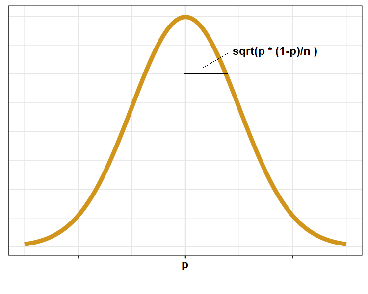
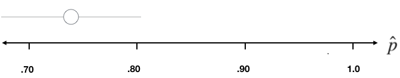
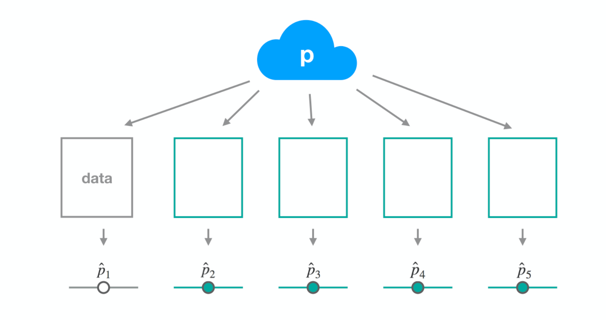
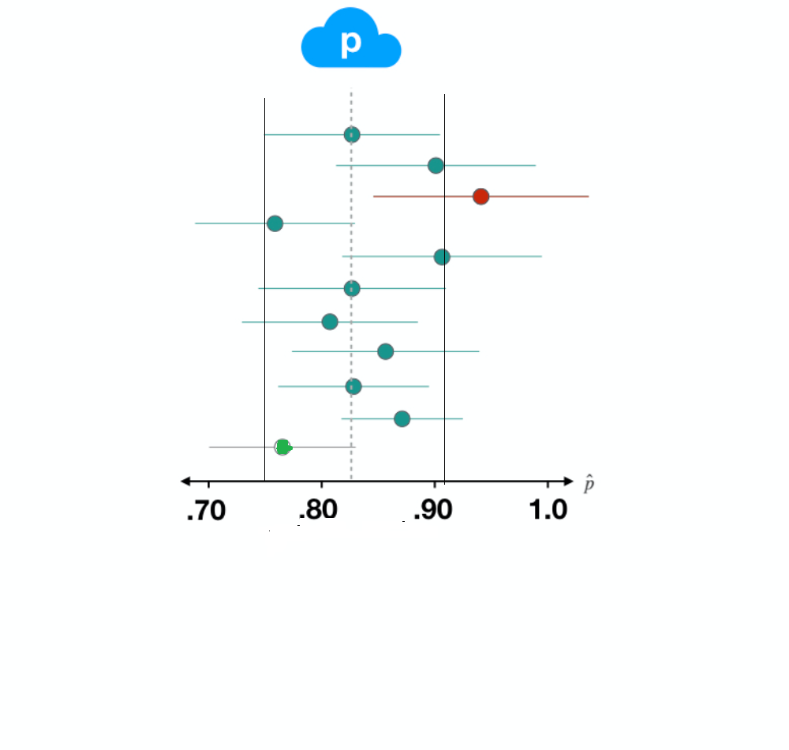

```{r setup, include = FALSE}

library(learnr)
library(tidyverse)


knitr::opts_chunk$set(fig.align = "center", 
                      fig.height = 3, 
                      fig.width = 5,
                      echo = FALSE, 
                      message = FALSE, 
                      warning = FALSE)
#tutorial_options(exercise.lines=15)
# data prep 
# load data
gss2016 <- read_csv(file="gss-sampled-2016.csv")

gss <- read.csv(file="gss-sampled.csv")

# objects to be used later
p_hat_happy <- gss2016 %>%
  summarize(prop_happy = mean(happy == "HAPPY")) %>%
  pull()
  
```

## The General Social Survey

Welcome to inference for categorical data! Categorical data arises in any situation where the values that you are recording are categories, not simply numbers. One particularly rich trove of categorical data can be found in the General Social Survey. Every year, researchers visit the homes of Americans and ask them a long list of questions about their history, behavior, and opinions on a number of topics of interest to social scientists.

```{r echo=FALSE, out.width = "60%"}

```


There are generally a few thousand people that are surveyed every year, but researchers
would like to make general statements about the opinions and social trends of the entire United States.


This process of inference from the sample to the population is possible because the researchers are careful to select their respondents in such a way that their sample is representative of the population of all Americans. The result is a data set where each sampled respondent is one row and each column is their response to a single question.

```{r echo=FALSE, out.width = "60%"}

```

### Exploring GSS

We have made available for you a sample of data from the General Social Survey in a data frame called `gss`. 

If we glimpse the data frame, we learn that there are 25 variables: a unique identifier for each respondent, then a series of demographic variables like age and sex.  If we go further down we get into the opinion questions. 

```{r ex0, exercise=TRUE}
#Take a peek at the data


```

The variable named `happy` records if respondents on balance feel `HAPPY`  or `UNHAPPY`. We're curious to learn what the distribution of responses are to this question in the most recent year of the survey, 2016.


## GSS 2016 and `happy`

We're going to focus on data from 2016, so we'll filter the data set to only include those rows and save it as a new data set called `gss2016`. You can take a peek at the dataframe you have created to make sure it actually was created.

```{r ex1, exercise=TRUE}
#create the subset gss2016 from gss

```


We'll focus on the `happy` variable, which is categorical and takes values "HAPPY" and "UNHAPPY", so we'll visualize it with a bar chart. Can you make the plot so the y axis shows percentages rather than frequencies?

```{r ex2, exercise=TRUE}

``` 

```{r ex2-hint-1}
ggplot(data=gss2016,mapping=aes(x=happy))+
   geom_bar(mapping=aes(y= , group= )) 
```

```{r ex2-solution}
ggplot(data=gss2016,mapping=aes(x=happy))+
   geom_bar(mapping=aes(y=..prop.., group=1)) 
```

Let's go a step further and calculate the exact proportion of the sample that responded this way. Let's call it `phat_happy`. 

```{r ex4, exercise=TRUE}  

``` 


```{r ex4-hint-1}  

gss2016 %>% summarize( phat_happy=mean())

``` 

```{r ex4-solution}  

gss2016 %>% summarize( phat_happy=mean(happy=="HAPPY"))

``` 

Note: `phat_happy` does not get saved as a variable by executing the above code. The following code does in fact save it as one. The command `pull()` from `dplyr` extracts a single column from a dataframe. Here, it is being used to simply extract a single summary number.


```{r pull-phat, echo=TRUE}

phat_happy<- gss2016 %>% summarize(mean(happy=="HAPPY")) %>% pull()

phat_happy
```


We learn that around 77.3% of our sample is "HAPPY". This should be a good estimate for the percentage of **all** Americans that are  happy, but it's not a sure thing since we only asked a small proportion of them.

### The sampling distribution

The inferential tools for a population proportion include confidence intervals and hypothesis tests. 
The *standard deviation* of the sample proportion is crucial for both as it  provides us with an idea of how far off our estimate may be from the population proportion.  

A useful result in mathematics called the **Central Limit Theorem** says that if you have independent observations and a sufficiently large sample size $n$, then `phat_happy` will follow a normal distribution:
\[ N\left(p, \sqrt{ \frac{p (1-p)}{n}}\right).\]

where $p$ is the proportion of **all** Americans who would have responsed as `HAPPY`.
The distribution is called the **sampling distribution** of `phat_happy`. 

What the central limit theorem says is that if we repeatedly sample and calculate `phat` from each sample, the `phat` values will line up in a bell shape around the true value `p`. The *typical* distance of any `phat` value from `p` will be given by its standard deviation. 

```{r echo=FALSE, out.width = "60%"}

```

Note: it is common to refer to the standard deviation of a statistic as its "standard error". The word "error" is thought to be more appropriate than the word "deviation" in this context since the goal is estimation of a parameter.

### Assessing model assumptions

The assumption of independence corresponds assuming a certain model for the data. How do we check if "observations are independent"? 

- This depends upon the data collection method. If the sample is drawn randomly without replacement from a large population, the observations are approximately independent.

What does "n is large" mean? 

- A common rule of thumb for claiming that  $n$ is large is that  $n \times p \geq 10$ and $n \times (1-p) \geq 10$. Since $p$ is the proportion of "HAPPY" people in the population, $n \times p$ is the **number** of HAPPY people we should *expect* in our sample of size $n$. Similarly $n ( 1-p)$ is the number of UNHAPPY people we should *expect* in our sample of size $n$.

OK, let's check the rule of thumb for the `gss2016` dataset. Since we don't know $p$, but we do know `phat_happy`, practically speaking, we use it in place of `p` to check the rule of thumb. 


```{r ex6, exercise=TRUE }
n=nrow(gss2016)

#number of happy = n times phat
#number of unhappy = n times (1- phat)


``` 

Also, since the GSS sample was selected by random sampling, the independence assumption is assumed to be reasonable. This all means that the normal approximation should be reasonably good. 

### How does the population proportion affect the standard error?

Imagine you've set out to survey 1000 people on two questions: are you at least 6-feet tall?
and are you left-handed?
Since both of these sample proportions were calculated from the same sample size, they should have the same standard error, right?
Wrong!
While the standard error does change with sample size, it is also affected by the population proportion.

Think back to the formula for the standard error: $SE = \sqrt{p(1-p)/n}$.

 Since the population proportion $p$ is in this $SE$ formula, it should make sense that the standard error is in some way dependent on the population proportion.
We can visualize this relationship by creating a plot of $SE$ vs. $p$.

Since the sample size is irrelevant to this discussion, let's just set it to some value ($n = 1000$) and use this value in the following calculations:

```{r n-for-me-plot, echo=T}
nsamp <- 1000
```

The first step is to make a variable `p` that is a sequence from 0 to 1 with each number incremented by 0.01.


```{r p-me, echo=T}
p <- seq(from = 0, to = 1, by = 0.01)
se <- sqrt(p * (1 - p)/nsamp)
```

Lastly, you can plot the two variables against each other to reveal their relationship.
To do so, we need to first put these variables in a data frame that you can call in the `ggplot` function.

```{r me-plot,echo=T}
dd <- data.frame(p = p, se = se)
ggplot(data = dd, aes(x = p, y = se)) + 
  geom_line() +
  labs(x = "Population Proportion", y = "Standard error")
```

```{r se, echo=FALSE}
question("Which of the following best describes the relationship between p and the SE of phat?",
  answer("As the population p gets closer to 0.5, our estimate becomes more precise", message="Nope, the SE increases the closer we get to 0.5. This means our estimate becomes less precise"),
  answer("As the population p gets closer to 0 or 1, our estimate becomes more precise", correct=TRUE, message="Good job! The SE decreases the closer we get to 0 or 1. This means our estimate does not change much from one sample to another."),
  answer("We cannot say anything about the relationship between the population p and SE since it also depends on n", message="Nope, while n does affect the value of the SE, it does not change the relationship between p and SE"),
  answer("Who cares? The SE doesn't change that much anyway", message = "True dat. However, understanding the relationship is still helpful. Try again!"),
  allow_retry = TRUE
)
```

You can investigate the interplay between $n$ and $p$ and the shape of the sampling distribution by using simulations.
Play around with the following app to investigate how the shape, center, and spread of the distribution of $\hat{p}$ changes as $n$ and $p$ changes.

```{r sf-app, echo=FALSE, eval=TRUE}
inputPanel(
  numericInput("n", label = "Sample size:", value = 300),
  
  sliderInput("p", label = "Population proportion:",
              min = 0, max = 1, value = 0.1, step = 0.01),
  
  numericInput("x_min", label = "Min for x-axis:", value = 0, min = 0, max = 1),
  numericInput("x_max", label = "Max for x-axis:", value = 1, min = 0, max = 1) )
plotOutput("distPlot")
```
```{r context="server"}
output$distPlot<-renderPlot({
  pp <- data.frame(p_hat = rep(0, 5000))
  for(i in 1:5000){
    samp <- sample(c(TRUE, FALSE), input$n, replace = TRUE, 
                   prob = c(input$p, 1 - input$p))
    pp$p_hat[i] <- sum(samp == TRUE) / input$n
  }
  bw <- diff(range(pp$p_hat))/80
  ggplot(data = pp, aes(x = p_hat)) +
    geom_histogram(binwidth = bw) +
    xlim(input$x_min, input$x_max) +
    ggtitle(paste0("Distribution of p_hats, drawn from p = ", input$p, ", n = ", input$n))
})
```


### Estimating the standard error

Since we don't know $p$, the standard error needs to be estimated before we can use it. The usual way to estimate it is to plug in $\widehat{p}$ as our guess for $p$. 

$$\sqrt{\frac{ \hat{p} \times (1 - \hat{p})}{n}}$$ 

## 95% confidence interval

The 95% confidence interval can be calculated as the sample proportion plus or minus two standard errors of the sample proportion:

$$(\hat{p} - 2 \times SE, \: \hat{p} + 2 \times SE)$$


The 95% confidence interval for the proportion of "HAPPY" Americans
can now be calculated from the `gss2016` dataset:

```{r echo=TRUE}
phat_happy=0.733
n=nrow(gss2016)

SE_happy <- sqrt(phat_happy * (1 - phat_happy) / n)
SE_happy

c(phat_happy-2*SE_happy, phat_happy+2*SE_happy)
``` 


When building _any_ confidence interval, note that you use three ingredients: the point estimate (here, `phat`), the SE, and the number of standard errors to add and subtract. For a sampling distribution that is bell-shaped, adding and subtracting two SEs corresponds to a confidence level of 95%. 


### CI for region

Now it's your turn. In this exercise, you will apply the normal approximation to build a confidence interval for the proportion of respondents that live in the pacific region. Let's call this $p_{region}$

- Calculate the sample size, `n`, which is the number of rows in the `gss2016` data frame.
- Calculated the observed statistic, `phat_region`, as the proportion of people with "region==PACIFIC".

```{r ex15, exercise=TRUE,exercise.lines=10}

```

```{r ex15-hint-1}
n <- nrow(gss2016)
```

```{r ex15-hint-2}
phat_region <- gss2016 %>%
  summarize(mean(region == "PACIFIC")) %>% pull()


```

```{r ex15-solution}
# Calculate n as the number of rows
n <- nrow(gss2016)
# Calculate p_hat as the proportion in pacific meta region
phat_region <- gss2016 %>%
  summarize(prop_pacific = mean(region == "PACIFIC")) %>%
  pull()
# View the result
p_hat_region
```


Now we'll construct the confidence interval around this proportion.

- Check the rules-of-thumb for the normal distribution being a decent approximation.
- Calculate the standard error using the approximation formula $\sqrt{\frac{\hat{p} \times (1 - \hat{p})}{n}}$.
- Use `SE_region` to form a confidence interval for `p_region`. The limits should be two standard errors either side of `phat_region`.

```{r ex16, exercise=TRUE}


```

```{r ex16-hint-1}
n=nrow(gss2016)
phat_region<-gss2016 %>% 
      summarize(mean(region=="PACIFIC")) %>% pull()
n * phat_region >= 10
n * (1 - phat_region) >= 10
```

```{r ex16-hint-2}
SE_region <- sqrt(phat_region * (1 - phat_region) / n)
```

```{r ex16-solution}
# From previous step
n <- nrow(gss2016)
phat_region <- gss2016 %>%
  summarize(prop_pacific = mean(region == "PACIFIC")) %>%
  pull()
# Check conditions
n * p_hat_region >= 10
n * (1 - p_hat_region) >= 10
# Calculate SE
SE_region <- sqrt(p_hat * (1 - p_hat) / n)
# Form 95% CI
c(phat_region - 2 * SE_region, phat_region + 2 * SE_region)
```


## Interpreting a Confidence Interval

We are 95% *confident* that the proportion of all Americans that are HAPPY is between 0.66 and 0.81.

What do we mean by *confident*? 

Let's look deeper into this by starting with the confidence interval that we've already formed. The data from which this interval was constructed is from 2016, and we can plot both p-hat and the resulting interval on a number line here. To understand what is meant by confident, we need to consider how this interval fits into the big picture.

```{r echo=FALSE, out.width = "60%"}

```

### The unknown proportion: p

There is thought to be a fixed but unknown parameter of interest, in this case the population proportion of Americans that are HAPPY.

```{r echo=FALSE, out.width = "60%"}

```


In 2016, the survey drew a small sample of this population.

```{r echo=FALSE, out.width = "60%"}
knitr::include_graphics("images/p-02.png")
```


```{r echo=FALSE, out.width = "60%"}

```

and quantified the uncertainty in that estimate with a confidence interval.

```{r echo=FALSE, out.width = "60%"}

```


Now imagine what would happen if we were to draw a new sample...

```{r echo=FALSE, out.width = "60%"}
knitr::include_graphics("images/p-05.png")
```

of the same size from that population and come up with a new p-hat and a new interval. It wouldn't be the same as our first, but it would likely be similar.

```{r echo=FALSE, out.width = "60%"}
knitr::include_graphics("images/p-06.png")
```


We can imagine doing this a third time: a new data sample,

```{r echo=FALSE, out.width = "60%"}
knitr::include_graphics("images/p-07.png")
```


a new p-hat and a new interval.

```{r echo=FALSE, out.width = "60%"}
knitr::include_graphics("images/p-08.png")
```

We can keep this thought experiment going

```{r echo=FALSE, out.width = "60%"}
knitr::include_graphics("images/p-09.png")
```

but what we want to focus on is the properties of this collection of confidence intervals that are accumulating.

```{r echo=FALSE, out.width = "60%"}

```

If we were to continue this process many times, we'd get many different $\hat{p}$s and many different intervals. About 95% of the $\hat{p}$ will lie within 2 standard errors around $p$. These intervals will capture that unknown population parameter $p$.

```{r echo=FALSE, out.width = "60%"}

```

```{r two-ci, echo=FALSE}
question("Two researchers set about calculating a 90% confidence interval for a population proportion. Researcher 1 uses a sample of size 100 and researcher 2 uses a sample of size 1,000. Which of the following is an untrue statement?",
  answer("Researcher 1 will likely not capture the population proportion in his interval since he has a smaller sample", correct=TRUE, message="Good job, this is a false statement. Since both are using 90% confidence, they both have the same chance of being within range of the parameter."),
  answer("The interval obtained by researcher 1 will be wider ",  message="This is a true statement. The SE becomes larger  as sample size decreases."),
  answer("The p-hat obtained by researcher 2 will be very close to the true p", message="This is a true statement. The SE becomes very small as sample size increases."),
  answer("Both researchers will use a z multiplier of 1.28 for calculating their interval", message = " This is a true statement. The 10th percentile of any normal distribution has a z score -1.28 and one can use +/- 1.28 as the multiplier.  "),
  allow_retry = TRUE
)
```

## Acknowledgment

This tutorial has been adapted from OpenIntro labs which can be found at [here](https://www.openintro.org/stat/labs.php) and also from [tutorials](https://openintrostat.github.io/ims-tutorials) designed for Intro to Modern Statistics 